# HCIA-Datacom Chapter Quizzes with Explanations

This document displays all chapter quiz questions (PNG images) with detailed explanations organized by chapter in numerical order.

**Note:** The explanation files (C*-Explanation.md) appear to be mislabeled. This document maps the explanations to the correct chapters based on their content.

## Directory Structure

- **C1-C6/**: Chapters 1-6
- **C7-C11/**: Chapters 7-11
- **C12-C17/**: Chapters 12-17
- **C18-C22/**: Chapters 18-22

---

## Chapter 1: Network Fundamentals

**Location:** `C1-C6/C1/`

### Q1-C1.png
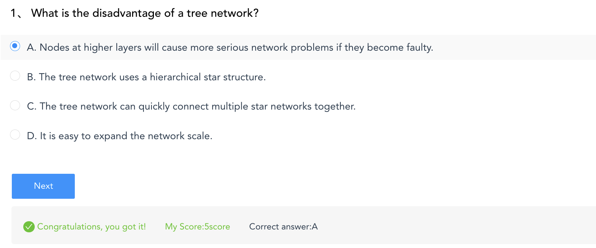

#### Explanation: Tree Network Disadvantages

**Question:** What is the disadvantage of a tree network?

**Correct Answer: A. Nodes at higher layers will cause more serious network problems if they become faulty.**

**Why A is correct:**

A tree topology is hierarchical. It has a "root" node and subsequent layers of child nodes. Because the lower layers depend on the connectivity provided by the upper layers, a failure at the top (the root or a core switch) disconnects every single node beneath it. This is known as a **single point of failure** for the branches below.

**Why the others are incorrect:**

* **B & C:** These describe structural characteristics or advantages (how a tree is built by connecting star networks), not disadvantages.
* **D:** This is actually an **advantage**. Tree networks are considered highly scalable because you can easily add new "branches" (hubs/switches) to expand the network.

---

### Q2-C1.png
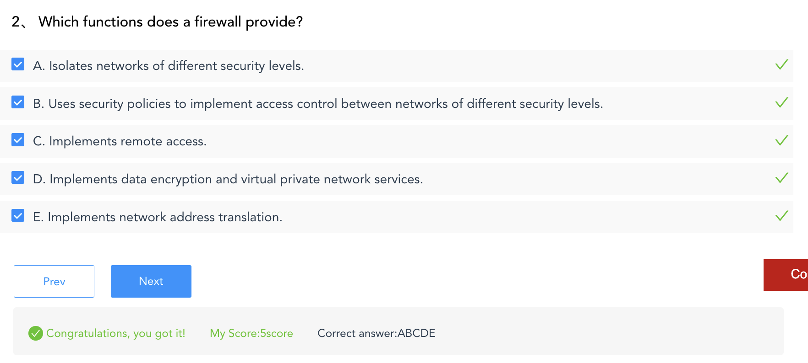

#### Explanation: Firewall Functions

**Question:** Which functions does a firewall provide?

**Correct Answer: A, B, C, D, E (All of them)**

**Why these are all correct:**

Modern "Next-Generation" Firewalls (NGFW) are multi-functional security appliances:

* **A & B (Isolation & Policies):** This is the core job of a firewall—segmenting a "Trusted" network (Internal) from an "Untrusted" one (Internet) using rules.
* **C & D (Remote Access & VPN):** Most enterprise firewalls act as VPN gateways, allowing remote employees to securely tunnel into the office network with encrypted data.
* **E (NAT):** Firewalls almost always perform Network Address Translation (NAT) to allow multiple devices on a private network to share a single public IP address.

---

### Q3-C1.png
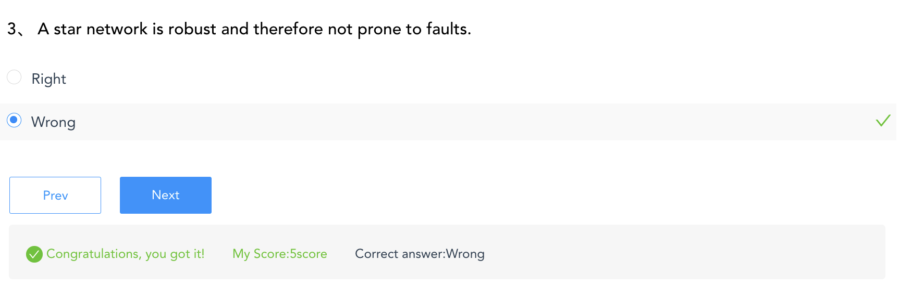

#### Explanation: Star Network Robustness

**Question:** A star network is robust and therefore not prone to faults.

**Correct Answer: Wrong**

**Why "Wrong" is correct:**

While a star network is better than a "Bus" network (where one cable break kills everything), it has a critical vulnerability: the **Central Hub/Switch**.

* If a single peripheral cable fails, only one computer goes down.
* **However**, if the central switch fails, the **entire network** fails. Because the whole network relies on one central piece of hardware, it cannot be described as "not prone to faults."

---

### Q4-C1.png
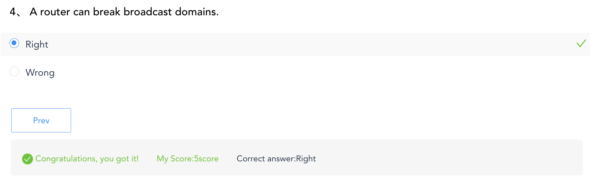

#### Explanation: Routers and Broadcast Domains

**Question:** A router can break broadcast domains.

**Correct Answer: Right**

**Why "Right" is correct:**

In networking, a "Broadcast" is a message sent to every device on a segment (like a shout in a room).

* **Switches** forward broadcasts to every port; they create one large "Broadcast Domain."
* **Routers** do not forward Layer 2 broadcasts by default. When a router receives a broadcast, it stops it. This "breaks" the domain into smaller, more manageable pieces, preventing network congestion (broadcast storms).

**Total Questions:** 4

---

## Chapter 2: Network Models and Protocols

**Location:** `C1-C6/C2/`

### Q1-C2.png
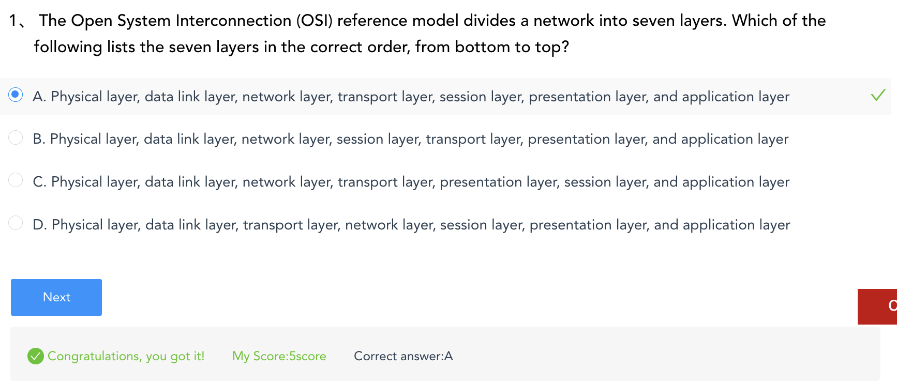

#### Explanation: OSI Model Layers and Order

**Question:** The Open System Interconnection (OSI) reference model divides a network into seven layers. Which of the following lists the seven layers in the correct order, from bottom to top?

**Correct Answer: A. Physical layer, data link layer, network layer, transport layer, session layer, presentation layer, and application layer**

**Why A is correct:**

The OSI model is a standardized framework used to understand network interactions. The "bottom-to-top" order refers to moving from the physical hardware (Layer 1) up to the user interface (Layer 7):

1. **Physical:** Binary transmission and cables.
2. **Data Link:** Physical addressing (MAC).
3. **Network:** Path determination and logical addressing (IP).
4. **Transport:** End-to-end connections and reliability.
5. **Session:** Interhost communication.
6. **Presentation:** Data representation and encryption.
7. **Application:** Network process to application.

**Why the others are incorrect:**

* **B, C, & D:** These options shuffle the middle layers (Network, Transport, Session, and Presentation) out of their standardized sequence.

---

### Q2-C2.png
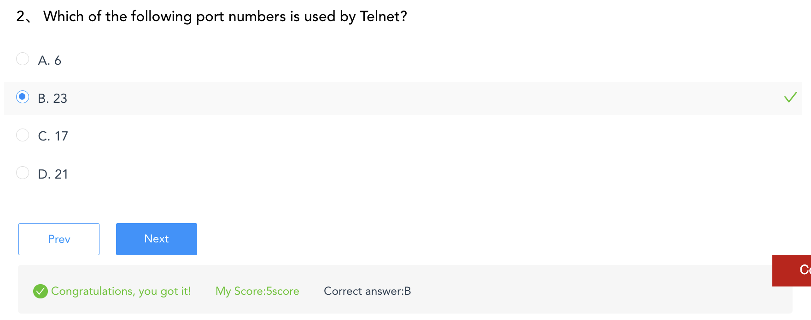

#### Explanation: Telnet Port Number

**Question:** Which of the following port numbers is used by Telnet?

**Correct Answer: B. 23**

**Why B is correct:**

Telnet is a legacy protocol used for remote terminal access. In the standard TCP/IP port assignments, Port **23** is specifically reserved for Telnet traffic.

**Why the others are incorrect:**

* **A (6):** This is not a common well-known service port; 6 is actually the protocol number for TCP itself within an IP header.
* **C (17):** Reserved for the "Quote of the Day" (QOTD) protocol.
* **D (21):** This port is used by **FTP** (File Transfer Protocol) for control signals.

---

### Q3-C2.png
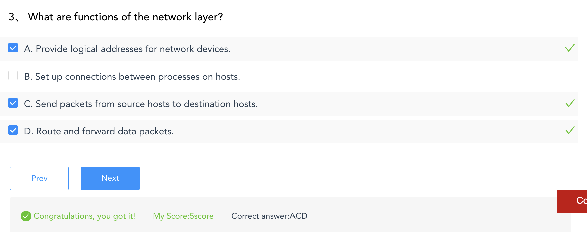

#### Explanation: Network Layer Functions

**Question:** What are functions of the network layer?

**Correct Answer: A, C, and D**

**Why these are correct:**

The Network Layer (Layer 3) is responsible for routing data between different networks:

* **A:** It provides **logical addresses** (such as IP addresses) so devices can be identified globally.
* **C & D:** Its core purpose is to **route and forward data packets** from the source host to the destination host across interconnected networks.

**Why B is incorrect:**

* **B:** Setting up connections between **processes** is a function of the **Transport Layer** (Layer 4) using port numbers, not the Network Layer.

---

### Q4-C2.png
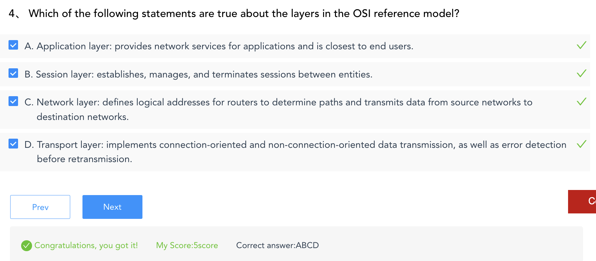

#### Explanation: OSI Model Statements

**Question:** Which of the following statements are true about the layers in the OSI reference model?

**Correct Answer: A, B, C, and D (All of them)**

**Why these are all correct:**

Each statement accurately describes the primary responsibility of that specific layer:

* **A (Application):** It is indeed the layer closest to the user (e.g., a web browser).
* **B (Session):** It acts as the "dialogue controller," managing the start and end of communications.
* **C (Network):** It defines IP addressing and path selection for routers.
* **D (Transport):** It handles the "how" of transmission, including connection-oriented (TCP) and connectionless (UDP) methods, and error recovery.

---

### Q5-C2.png
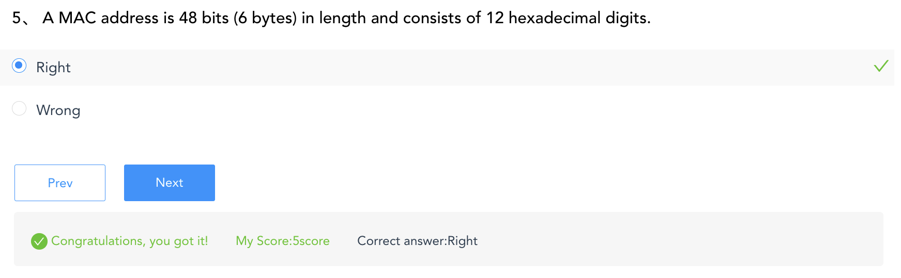

#### Explanation: MAC Address Structure

**Question:** A MAC address is 48 bits (6 bytes) in length and consists of 12 hexadecimal digits.

**Correct Answer: Right**

**Why "Right" is correct:**

A Media Access Control (MAC) address is the permanent physical address of a network interface card (NIC). It is expressed as 12 hex characters (0-9, A-F), such as `00:1A:2B:3C:4D:5E`. Since each hex digit represents 4 bits, 48 bits total (which equals 6 bytes).

---

### Q6-C2.png
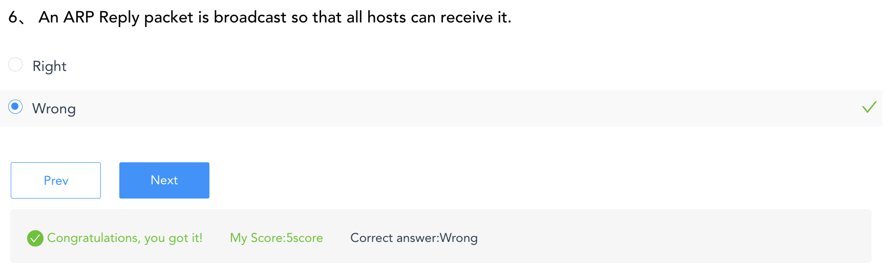

#### Explanation: ARP Reply Packets

**Question:** An ARP Reply packet is broadcast so that all hosts can receive it.

**Correct Answer: Wrong**

**Why "Wrong" is correct:**

Address Resolution Protocol (ARP) works in two steps:

1. **ARP Request:** This **is** a broadcast ("Who has IP X.X.X.X?").
2. **ARP Reply:** This is a **Unicast** packet. Because the requester's MAC address was included in the original request, the replying device sends the answer directly to that specific host rather than bothering the entire network.

---

### Q7-C2.png
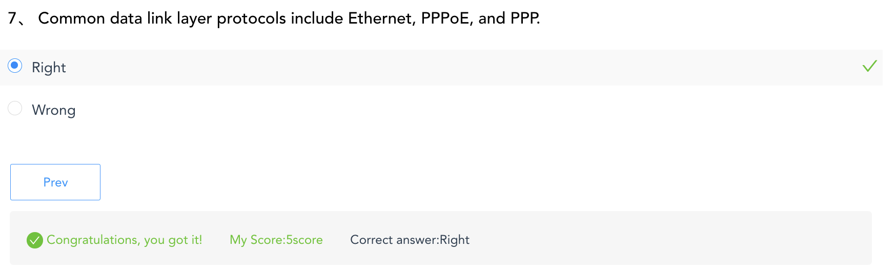

#### Explanation: Data Link Layer Protocols

**Question:** Common data link layer protocols include Ethernet, PPPoE, and PPP.

**Correct Answer: Right**

**Why "Right" is correct:**

The Data Link Layer (Layer 2) handles how data is framed for the physical wire:

* **Ethernet:** The standard for local area networks (LANs).
* **PPP (Point-to-Point Protocol):** Used for direct connections between two nodes.
* **PPPoE (PPP over Ethernet):** Commonly used by ISPs to connect users to the internet via DSL.

**Total Questions:** 7

---

## Chapter 3: VRP Basics

**Location:** `C1-C6/C3/`

### Q1-C3.png
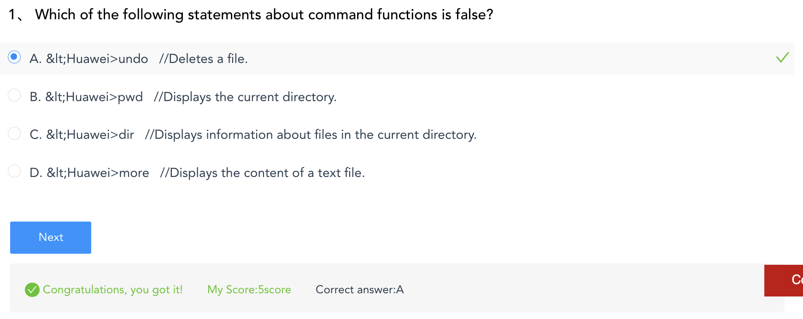

#### Explanation: False Command Functions

**Question:** Which of the following statements about command functions is false?

**Correct Answer: A. <Huawei>undo //Deletes a file.**

**Why A is correct (False Statement):**

The `undo` command is used to restore default settings, disable a function, or delete a specific configuration line. It is **not** used for file system management. To delete a file on a Huawei device, the command used is typically `delete`.

**Why the others are true:**

* **B:** The `pwd` (Print Working Directory) command correctly displays the path of the directory you are currently in.
* **C:** The `dir` command is standard for listing files and subdirectories within the current directory.
* **D:** The `more` command is used to read the contents of a text file (like a configuration file) directly in the terminal.

---

### Q2-C3.png
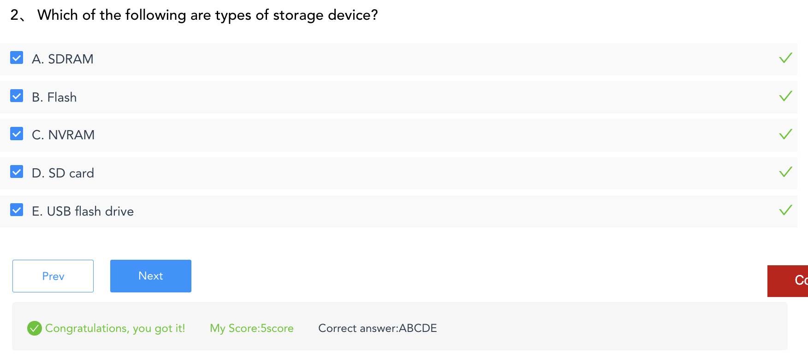

#### Explanation: Storage Device Types

**Question:** Which of the following are types of storage device?

**Correct Answer: A, B, C, D, E (All of them)**

**Why these are all correct:**

Network devices utilize various types of memory and storage to function:

* **A (SDRAM):** Synchronous Dynamic Random Access Memory, used as the main system memory for running processes.
* **B (Flash):** Used to store the system software (VRP image) and configuration files.
* **C (NVRAM):** Non-Volatile RAM, used to store critical data that must survive a reboot, such as the startup configuration.
* **D & E (SD card / USB):** Removable storage media used for easy file transfers, software upgrades, or log exports.

---

### Q3-C3.png
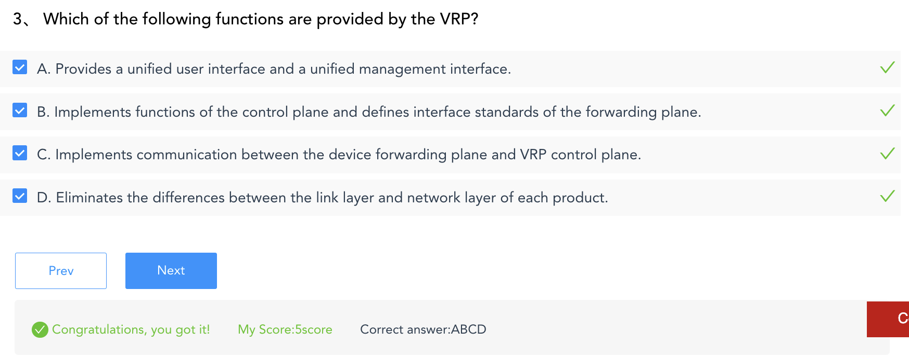

#### Explanation: VRP Functions

**Question:** Which of the following functions are provided by the VRP?

**Correct Answer: A, B, C, D (All of them)**

**Why these are all correct:**

The Versatile Routing Platform (VRP) is the network operating system for Huawei devices. Its functions include:

* **A:** Providing a consistent User Interface (CLI) and management experience across different hardware.
* **B:** Managing the **Control Plane** (routing logic) and standardizing how data is handled by the **Forwarding Plane** (actual data movement).
* **C:** Ensuring seamless communication between the hardware's forwarding engine and the software's control logic.
* **D:** Abstracting the underlying hardware so that different products can use the same link layer and network layer features.

---

### Q4-C3.png
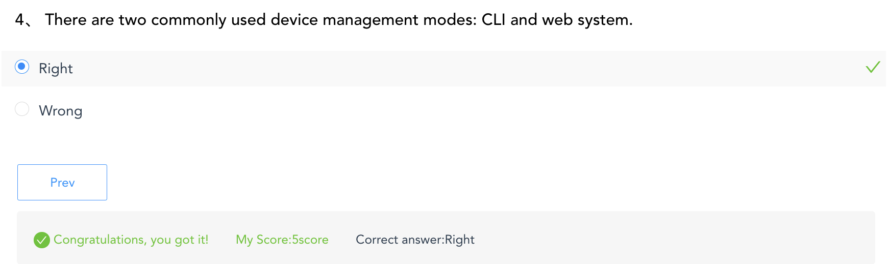

#### Explanation: Device Management Modes

**Question:** There are two commonly used device management modes: CLI and web system.

**Correct Answer: Right**

**Why "Right" is correct:**

Most modern network devices offer these two primary interfaces:

1. **CLI (Command Line Interface):** Preferred by experts for fast, detailed, and scriptable configuration via Console, Telnet, or SSH.
2. **Web System (GUI):** A browser-based interface that is more intuitive for beginners or for performing visual monitoring and basic tasks.

**Total Questions:** 4

---

## Chapter 4: IP Protocol

**Location:** `C1-C6/C4/`

### Q1-C4.png
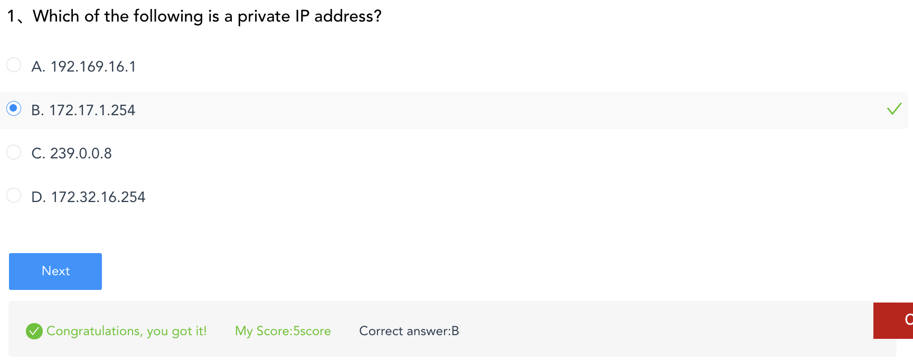

#### Explanation: Private IP Address

**Question:** Which of the following is a private IP address?
**A.** 192.169.16.1
**B.** 172.17.1.254
**C.** 239.0.0.8
**D.** 172.32.16.254

**Correct Answer: B**

**Why B is correct:**

To identify the correct answer, you must remember the three specific ranges reserved by **RFC 1918** for private internal networks. Any IP address falling outside these ranges is considered a Public address (routable on the internet) or a Multicast address.

**The Reserved Private IP Ranges:**

1. **Class A:** `10.0.0.0` to `10.255.255.255`
2. **Class B:** `172.16.0.0` to `172.31.255.255`
3. **Class C:** `192.168.0.0` to `192.168.255.255`

**Analysis of Options:**

* **A. 192.169.16.1:** This is **Public**. The private Class C range ends at 192.168.x.x. Since this is 169, it is outside the private range.
* **B. 172.17.1.254 (Correct):** This is **Private**. It falls within the Class B private range (`172.16.x.x` through `172.31.x.x`). 17 is between 16 and 31.
* **C. 239.0.0.8:** This is a **Multicast** address (Class D). Class D ranges from `224.0.0.0` to `239.255.255.255`.
* **D. 172.32.16.254:** This is **Public**. The private Class B range ends exactly at 172.**31**.x.x. Therefore, 172.32 is a public address.

---

### Q2-C4.png
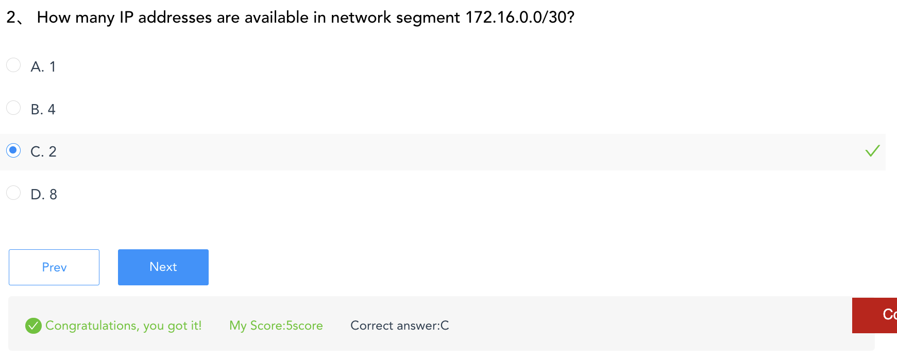

#### Explanation: IP Addresses in /30 Network

**Question:** How many IP addresses are available in network segment 172.16.0.0/30?
**A.** 1
**B.** 4
**C.** 2
**D.** 8

**Correct Answer: C**

**Why C is correct:**

To find the number of **available** (usable) host addresses, we use the formula 2^n - 2, where n is the number of host bits.

1. A **/30** prefix means 30 bits are for the network, leaving **2 bits** for hosts (32 - 30 = 2).
2. Total addresses = 2² = 4.
3. We must subtract **2** (one for the Network ID `172.16.0.0` and one for the Broadcast address `172.16.0.3`).
4. Available host addresses = 4 - 2 = 2.

*Note: /30 subnets are commonly used for point-to-point links between two routers.*

---

### Q3-C4.png
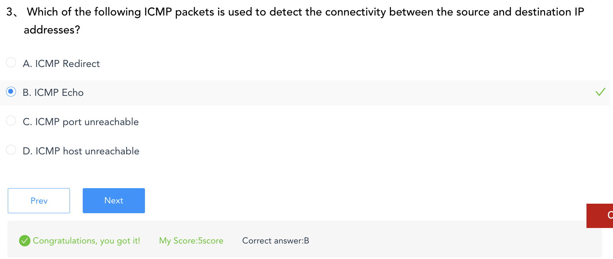

#### Explanation: ICMP Packets for Connectivity

**Question:** Which of the following ICMP packets is used to detect the connectivity between the source and destination IP addresses?
**A.** ICMP Redirect
**B.** ICMP Echo
**C.** ICMP port unreachable
**D.** ICMP host unreachable

**Correct Answer: B**

**Why B is correct:**

The `ping` utility uses **ICMP Echo** messages to test reachability.

* The source sends an **ICMP Echo Request**.
* The destination responds with an **ICMP Echo Reply**.
If the Echo Reply is received, connectivity is confirmed. Options C and D are "Destination Unreachable" error messages, and Option A is used by routers to inform a host of a better path, not to test connectivity.

---

### Q4-C4.png
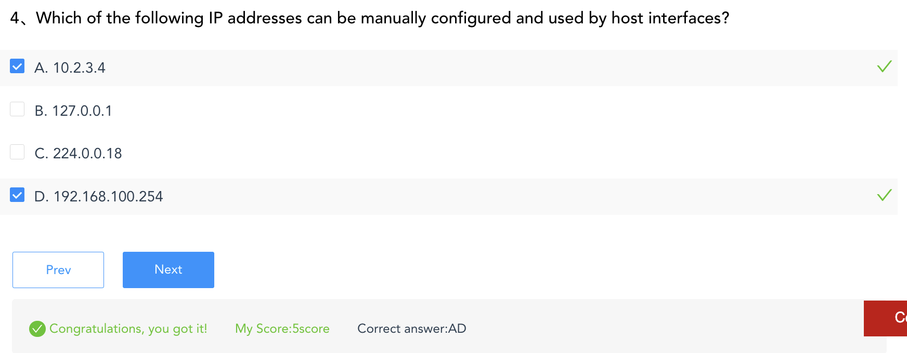

#### Explanation: Configurable Host IP Addresses

**Question:** Which of the following IP addresses can be manually configured and used by host interfaces? (Multiple Choice)
**A.** 10.2.3.4
**B.** 127.0.0.1
**C.** 224.0.0.18
**D.** 192.168.100.254

**Correct Answer: A and D**

**Why A and D are correct:**

* **A (10.2.3.4):** This is a standard Class A private unicast address. It is valid for a host.
* **D (192.168.100.254):** This is a standard Class C private unicast address. It is valid for a host.

**Why the others are incorrect:**

* **B (127.0.0.1):** This is the **Loopback** address. It is reserved for internal testing within a device and cannot be assigned to a physical host interface.
* **C (224.0.0.18):** This is a **Multicast** address (Class D). These are used for sending data to a group and cannot be assigned as a unique IP to a host interface.

---

### Q5-C4.png
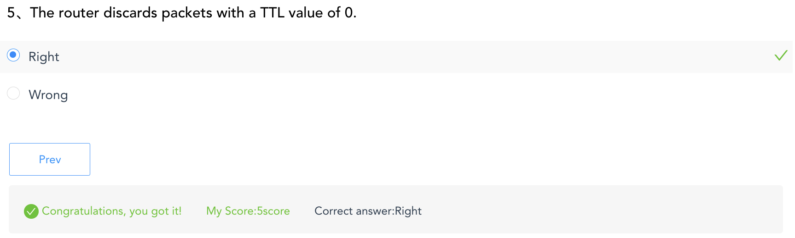

#### Explanation: TTL and Packet Discarding

**Question:** The router discards packets with a TTL value of 0.
**A.** Right
**B.** Wrong

**Correct Answer: Right**

**Why "Right" is correct:**

The **TTL (Time to Live)** field is a mechanism to prevent packets from looping infinitely in a network. Every router that processes a packet decrements (subtracts 1) the TTL value. If a router receives a packet and the TTL becomes **0**, the router must discard the packet and typically sends an **ICMP Time Exceeded** message back to the source.

**Total Questions:** 5

---

## Chapter 5: Routing Fundamentals

**Location:** `C1-C6/C5/`

### Q1-C5.png
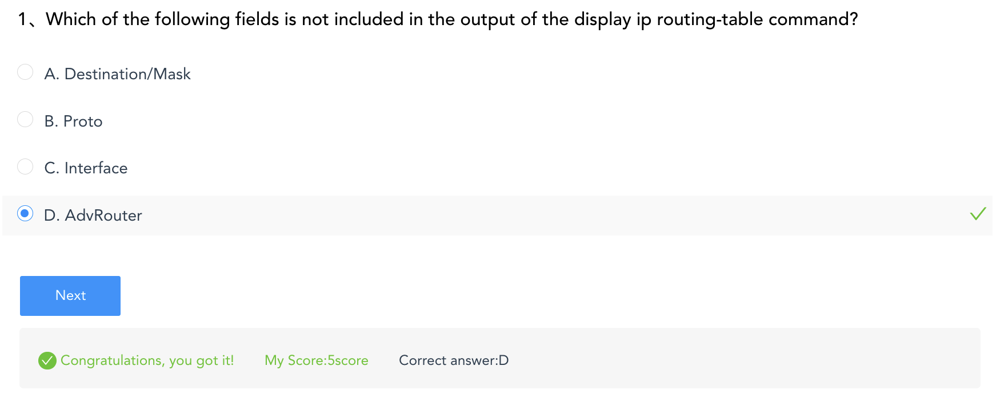

#### Explanation: Routing Table Contents

**Question:** Which of the following fields is not included in the output of the `display ip routing-table` command?
**A.** Destination/Mask
**B.** Proto
**C.** Interface
**D.** AdvRouter

**Correct Answer: D**

**Why D is correct:**

When you run the `display ip routing-table` command on a Huawei VRP device, the brief output shows the fundamental information needed for packet forwarding:

* **Destination/Mask:** The target network and its prefix length.
* **Proto:** The protocol that learned the route (e.g., Direct, Static, OSPF).
* **Pre:** The preference (priority) of the route.
* **Cost:** The metric of the route.
* **Flags:** Status indicators (e.g., R for relay, D for download to FIB).
* **NextHop:** The IP address of the next router.
* **Interface:** The outbound physical or logical interface.

**AdvRouter** (Advertising Router) is a field found in specific protocol databases (like the OSPF LSDB) but is **not** part of the standard IP routing table's brief output.

---

### Q2-C5.png
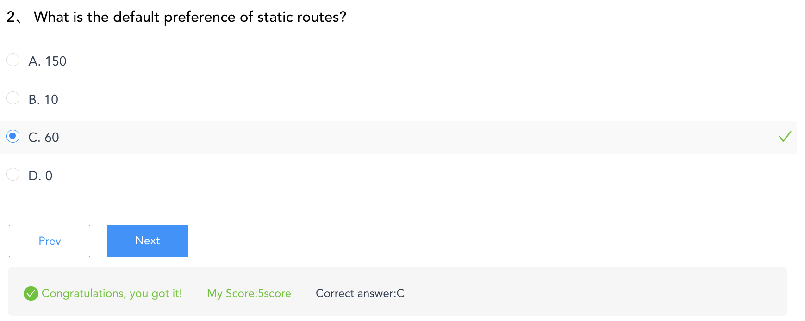

#### Explanation: Default Route Preference

**Question:** What is the default preference of static routes?
**A.** 150
**B.** 10
**C.** 60
**D.** 0

**Correct Answer: C**

**Why C is correct:**

Preference (also known as Administrative Distance) determines which protocol is "trusted" most when multiple protocols provide a path to the same destination. **Lower values are preferred.**

* **Direct:** 0 (Most trusted)
* **OSPF:** 10
* **Static:** **60**
* **RIP:** 100
* **BGP:** 255 (Least trusted)

---

### Q3-C5.png
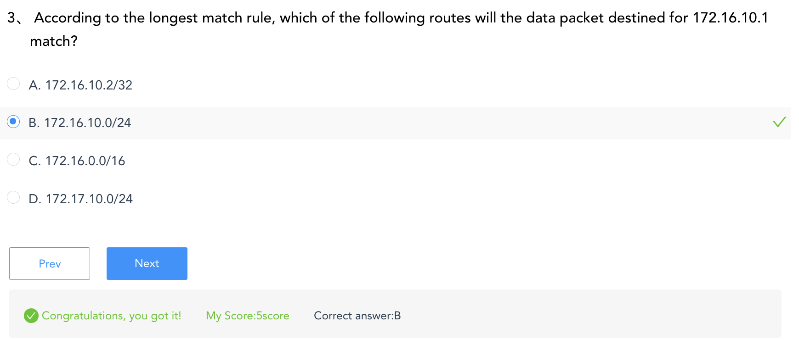

#### Explanation: The Longest Match Rule

**Question:** According to the longest match rule, which of the following routes will the data packet destined for 172.16.10.1 match?
**A.** 172.16.10.2/32
**B.** 172.16.10.0/24
**C.** 172.16.0.0/16
**D.** 172.17.10.0/24

**Correct Answer: B**

**Why B is correct:**

The **Longest Match Rule** states that if a packet matches multiple entries in the routing table, the router will choose the one with the **highest mask length** (the most specific route).

* **A:** Does not match (172.16.10.2 is a different host than 172.16.10.1).
* **B:** Matches. The first 24 bits (172.16.10) match perfectly.
* **C:** Matches. The first 16 bits (172.16) match.
* **Comparison:** Between B (/24) and C (/16), B is the "longer" match and is selected.
* **D:** Does not match (172.17 vs 172.16).

---

### Q4-C5.png
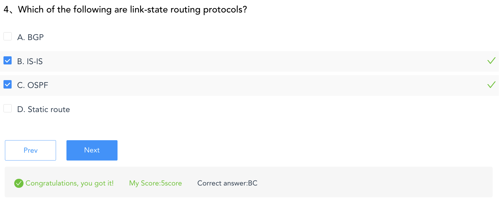

#### Explanation: Link-State Routing Protocols

**Question:** Which of the following are link-state routing protocols? (Multiple Choice)
**A.** BGP
**B.** IS-IS
**C.** OSPF
**D.** Static route

**Correct Answer: B and C**

**Why B and C are correct:**

Routing protocols are categorized by how they share information:

* **Link-State (B & C):** OSPF and IS-IS. These protocols share the entire "map" (topology) of the network. Every router calculates the best path independently using the SPF (Dijkstra) algorithm.
* **Distance-Vector:** RIP and BGP (BGP is technically Path-Vector). These protocols share their routing tables with neighbors ("routing by rumor").
* **Static:** Not a dynamic protocol at all; it is manually configured.

---

### Q5-C5.png
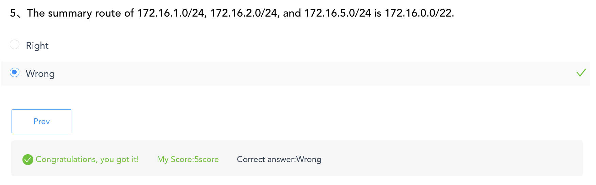

#### Explanation: Summary Route

**Question:** The summary route of 172.16.1.0/24, 172.16.2.0/24, and 172.16.5.0/24 is 172.16.0.0/22.
**A.** Right
**B.** Wrong

**Correct Answer: Wrong**

**Why "Wrong" is correct:**

To summarize these routes, we look at the third octet in binary:

* 1: `0000 0001`
* 2: `0000 0010`
* 5: `0000 0101`

A **/22** mask means the first 22 bits must be identical. A /22 mask in the third octet covers a range of **4** (e.g., 0 to 3).

* 172.16.0.0/22 covers `172.16.0.0` to `172.16.3.255`.
Because **172.16.5.0** falls outside that range, `172.16.0.0/22` is **not** a valid summary for all three. You would need a **/21** (which covers 0-7) to include all three networks.

**Total Questions:** 5

---

## Chapter 6: OSPF

**Location:** `C1-C6/C6/`

### Q1-C6.png
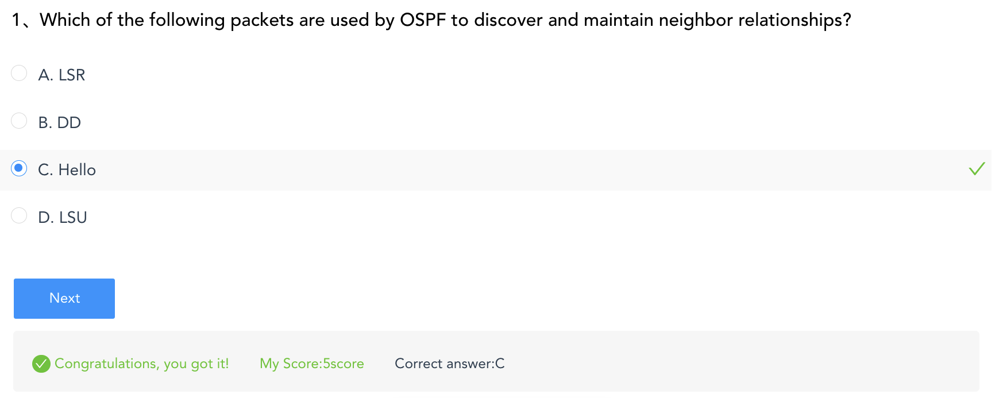

#### Explanation: OSPF Packets for Neighbor Discovery

**Question:** Which of the following packets are used by OSPF to discover and maintain neighbor relationships?
**A.** LSR
**B.** DD
**C.** Hello
**D.** LSU

**Correct Answer: C**

**Why C is correct:**

OSPF uses five types of packets, but only the **Hello packet** is used for discovery and maintenance.

* **Hello:** Sent periodically (default every 10s on broadcast networks) to find neighbors and act as a "keepalive" to ensure they are still active.
* **DD (Database Description):** Used during the exchange phase to describe the contents of the database.
* **LSR (Link State Request):** Asks for specific missing data.
* **LSU (Link State Update):** Carries the actual routing information (LSAs).
* **LSAck:** Acknowledges receipt.

---

### Q2-C6.png
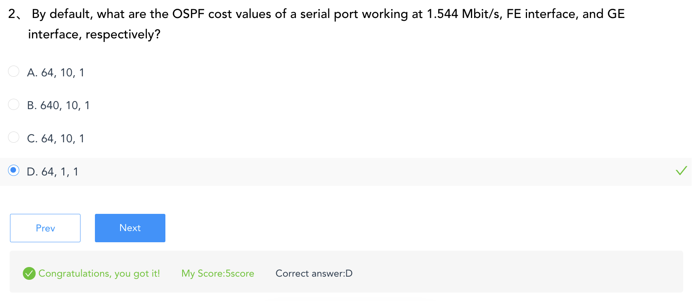

#### Explanation: OSPF Cost Values

**Question:** By default, what are the OSPF cost values of a serial port working at 1.544 Mbit/s, FE interface, and GE interface, respectively?
**A.** 64, 10, 1
**B.** 640, 10, 1
**C.** 64, 10, 1
**D.** 64, 1, 1

**Correct Answer: D**

**Why D is correct:**

OSPF calculates cost using the formula: Cost = Reference Bandwidth / Interface Bandwidth.
In Huawei VRP, the default **Reference Bandwidth** is **100 Mbit/s**.

1. **Serial (1.544 Mbit/s):** 100 / 1.544 ≈ 64. Integer value is **64**.
2. **Fast Ethernet (100 Mbit/s):** 100 / 100 = 1.
3. **Gigabit Ethernet (1000 Mbit/s):** 100 / 1000 = 0.1. Since the minimum cost is 1, it becomes **1**.

*Note: This is why many engineers increase the reference bandwidth to 1000 or 10000 on modern networks so GE/10GE can have different costs.*

---

### Q3-C6.png
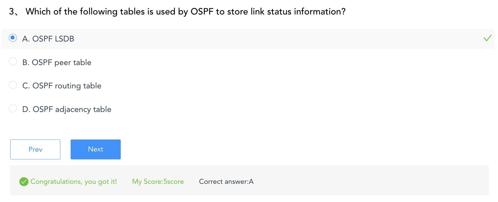

#### Explanation: OSPF Table for Link Status

**Question:** Which of the following tables is used by OSPF to store link status information?
**A.** OSPF LSDB
**B.** OSPF peer table
**C.** OSPF routing table
**D.** OSPF adjaceny table

**Correct Answer: A**

**Why A is correct:**

OSPF maintains three distinct databases/tables:

1. **Peer Table (Neighbor Table):** Lists discovered neighbors.
2. **LSDB (Link State Database):** This is the "map" of the entire area. It stores all received **LSAs (Link State Advertisements)**. This is where link status information lives.
3. **Routing Table:** The result of the SPF calculation (the best paths).

---

### Q4-C6.png
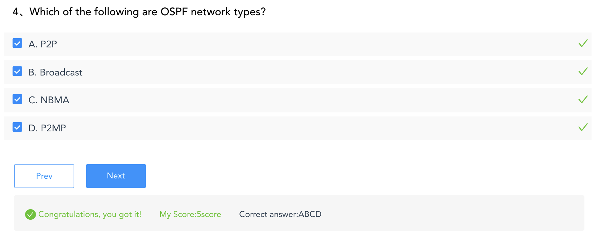

#### Explanation: OSPF Network Types

**Question:** Which of the following are OSPF network types? (Multiple Choice)
**A.** P2P
**B.** Broadcast
**C.** NBMA
**D.** P2MP

**Correct Answer: A, B, C, D (All of them)**

**Why these are all correct:**

OSPF adapts its behavior based on the underlying Layer 2 technology:

* **P2P (Point-to-Point):** Used for PPP or HDLC links. No DR/BDR election.
* **Broadcast:** Default for Ethernet. Requires **DR/BDR** election.
* **NBMA (Non-Broadcast Multi-Access):** Used for older technologies like Frame Relay or ATM. Neighbors must be manually configured.
* **P2MP (Point-to-Multipoint):** A variation used for star-topologies. No DR/BDR election.

---

### Q5-C6.png
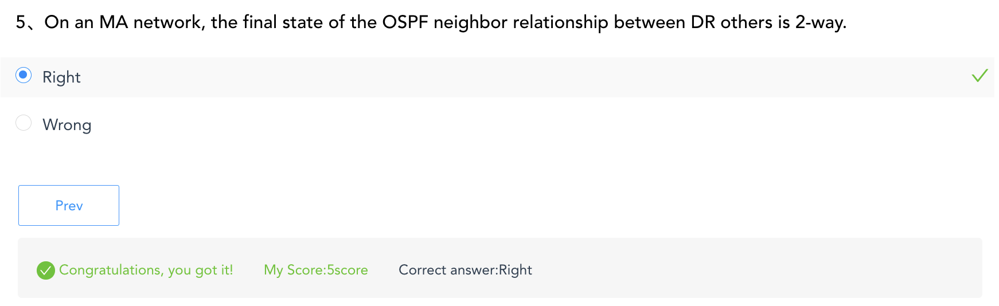

#### Explanation: DR Others Final State

**Question:** On an MA network, the final state of the OSPF neighbor relationship between DR others is 2-way.
**A.** Right
**B.** Wrong

**Correct Answer: Right**

**Why "Right" is correct:**

On a Multi-Access (MA) network like Ethernet, routers only reach the **FULL** state with the **DR (Designated Router)** and the **BDR (Backup Designated Router)**.
Two "ordinary" routers (known as **DR Others**) do not need to synchronize their entire databases with each other. They stop their state machine at **2-way**, meaning they know each other exists but they rely on the DR to pass them the routing updates. This reduces the amount of OSPF traffic on the segment.

**Total Questions:** 5

---

## Chapter 7: Ethernet Switching

**Location:** `C7-C11/C7/`

### Q1-C7.png
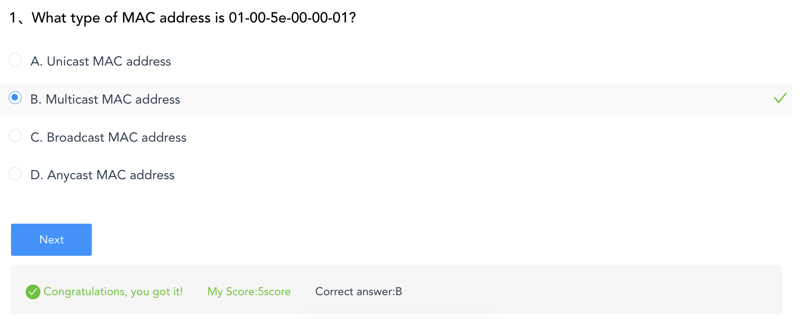

#### Explanation: MAC Address Type

**Question:** What type of MAC address is 01-00-5e-00-00-01?
**A.** Unicast MAC address
**B.** Multicast MAC address
**C.** Broadcast MAC address
**D.** Anycast MAC address

**Correct Answer: B**

**Why B is correct:**

MAC addresses are categorized by their first octet:

* **Unicast:** The least significant bit of the first octet is 0.
* **Multicast:** The least significant bit of the first octet is 1. Specifically, IPv4 multicast MAC addresses always start with the prefix 01-00-5e.
* **Broadcast:** All bits are 1 (FF-FF-FF-FF-FF-FF).

The address 01-00-5e-00-00-01 is the standard multicast MAC used for "All Systems on this Subnet" (mapping to IP 224.0.0.1).

---

### Q2-C7.png
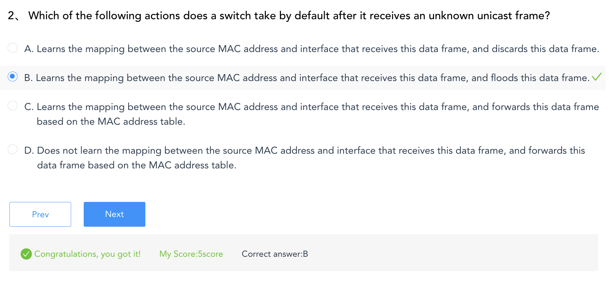

#### Explanation: Switch Handling of Unknown Unicast Frames

**Question:** Which of the following actions does a switch take by default after it receives an unknown unicast frame?
**A.** Learns the mapping... and discards this data frame.
**B.** Learns the mapping between the source MAC address and interface that receives this data frame, and floods this data frame.
**C.** Learns the mapping... and forwards this data frame based on the MAC address table.
**D.** Does not learn...

**Correct Answer: B**

**Why B is correct:**

A switch performs three main operations when a frame arrives:

1. **Learning:** It records the Source MAC and the incoming port in its MAC Address Table.
2. **Lookup:** It looks for the Destination MAC in its table.
3. **Forwarding/Flooding:** Since the Destination MAC is "Unknown" (not in the table), the switch must flood the frame out of all ports except the one it arrived on to ensure it reaches the destination.

---

### Q3-C7.png
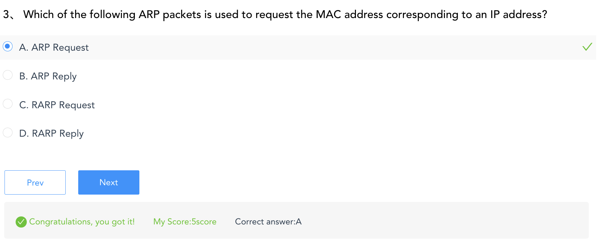

#### Explanation: ARP Packets

**Question:** Which of the following ARP packets is used to request the MAC address corresponding to an IP address?
**A.** ARP Request
**B.** ARP Reply
**C.** RARP Request
**D.** RARP Reply

**Correct Answer: A**

**Why A is correct:**

As covered in earlier chapters, the ARP Request is the "question" sent by a host asking for a MAC address.

* **ARP Request:** "I have IP X, who has IP Y? Send me your MAC." (Broadcast)
* **ARP Reply:** "I am IP Y, here is my MAC." (Unicast)
* **RARP:** Reverse ARP is used to find an IP if you only have a MAC (mostly obsolete).

---

### Q4-C7.png
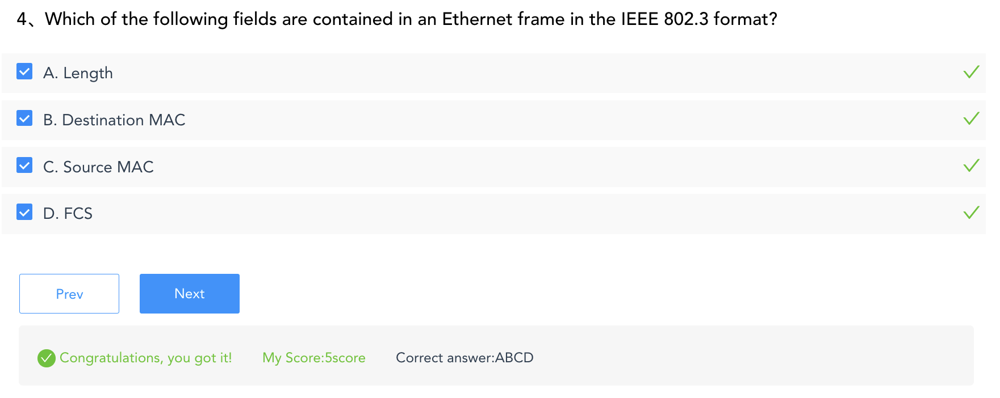

#### Explanation: Ethernet Frame Fields (IEEE 802.3)

**Question:** Which of the following fields are contained in an Ethernet frame in the IEEE 802.3 format? (Multiple Choice)
**A.** Length
**B.** Destination MAC
**C.** Source MAC
**D.** FCS

**Correct Answer: A, B, C, D (All of them)**

**Why these are all correct:**

The IEEE 802.3 frame structure includes:

* **Destination MAC (6 bytes):** Where the frame is going.
* **Source MAC (6 bytes):** Where the frame came from.
* **Length (2 bytes):** In 802.3, this field indicates the length of the data (In Ethernet II, this is the "Type" field).
* **Data/Payload:** The encapsulated packet.
* **FCS (Frame Check Sequence):** A 4-byte CRC used to detect errors during transmission.

---

### Q5-C7.png
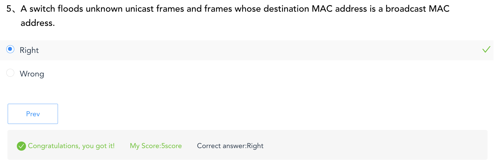

#### Explanation: Switch Flooding Behavior

**Question:** A switch floods unknown unicast frames and frames whose destination MAC address is a broadcast MAC address.
**A.** Right
**B.** Wrong

**Correct Answer: Right**

**Why "Right" is correct:**

This is a fundamental rule of switch behavior called BUM traffic handling (Broadcast, Unknown Unicast, and Multicast).

* **Broadcast:** Must go to everyone.
* **Unknown Unicast:** The switch doesn't know where the destination is, so it must flood it to find it.
* **Multicast:** By default (without IGMP Snooping), a switch treats multicast like a broadcast and floods it.

**Total Questions:** 5

---

## Chapter 8: VLAN

**Location:** `C7-C11/C8/`

### Q1-C8.png
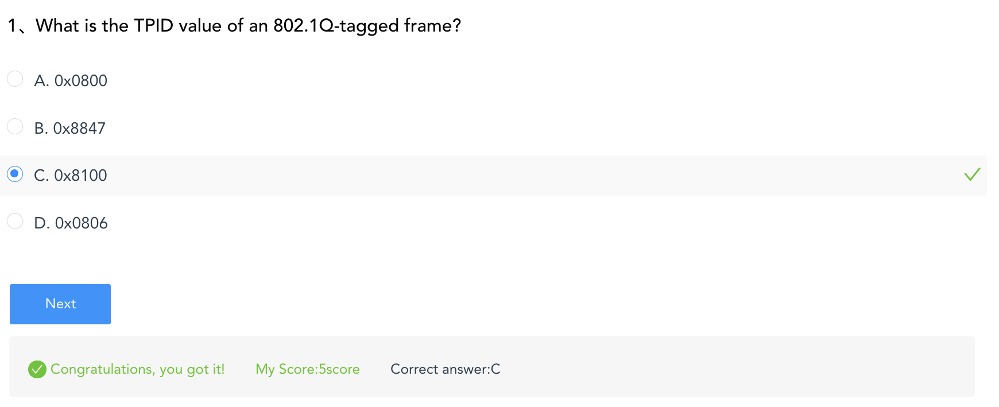

#### Explanation: TPID Value in 802.1Q Tagged Frame

**Question:** What is the TPID value of an 802.1Q-tagged frame?
**A.** 0x0800
**B.** 0x8847
**C.** 0x8100
**D.** 0x0806

**Correct Answer: C**

**Why C is correct:**

The **TPID (Tag Protocol Identifier)** is a 16-bit field in an Ethernet frame that indicates that a VLAN tag (802.1Q) follows. The fixed value for this is **0x8100**.

* **0x0800** is for standard IPv4.
* **0x0806** is for ARP.
* **0x8847** is for MPLS unicast.

---

### Q2-C8.png
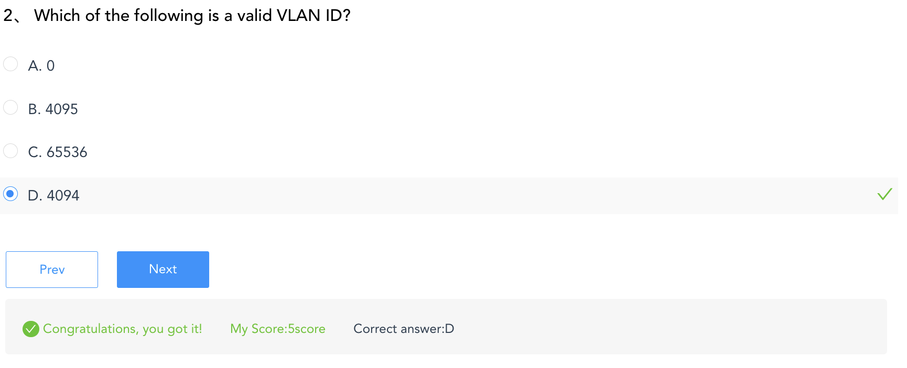

#### Explanation: Valid VLAN ID

**Question:** Which of the following is a valid VLAN ID?
**A.** 0
**B.** 4095
**C.** 65536
**D.** 4094

**Correct Answer: D**

**Why D is correct:**

VLAN IDs are stored in a 12-bit field within the 802.1Q tag (2¹² = 4096).

* The range is **0 to 4095**.
* However, **0** and **4095** are reserved for system use.
* Therefore, the **usable** range for configuration is **1 to 4094**.

---

### Q3-C8.png
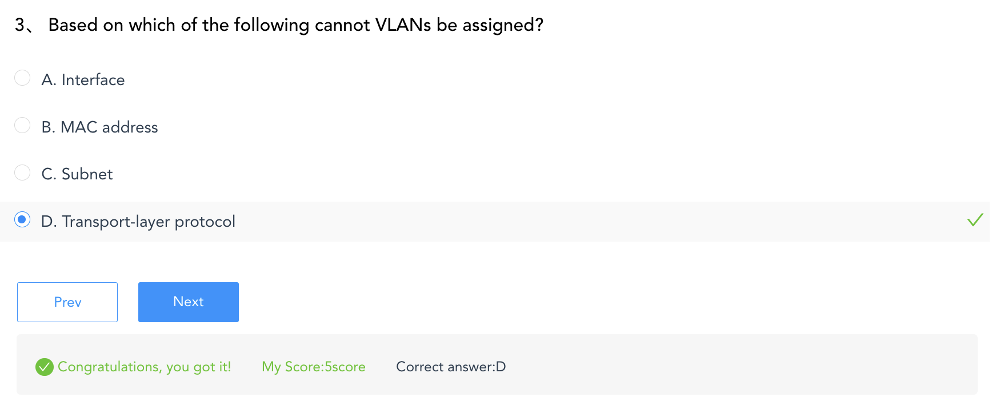

#### Explanation: VLAN Assignment Methods

**Question:** Based on which of the following cannot VLANs be assigned?
**A.** Interface
**B.** MAC address
**C.** Subnet
**D.** Transport-layer protocol

**Correct Answer: D**

**Why D is correct:**

VLANs are typically assigned based on Layer 2 or Layer 3 information:

* **Interface-based (Most common):** The VLAN is tied to a physical port.
* **MAC-based:** The VLAN is assigned based on the source MAC address.
* **Subnet-based:** The VLAN is assigned based on the source IP subnet.
* **Protocol-based:** Assigned based on the Network Layer protocol (e.g., IPv4 vs IPv6).

There is no standard method for assigning VLANs based on **Transport-layer protocols** (TCP/UDP ports).

---

### Q4-C8.png

#### Explanation: Interfaces Processing Multiple VLAN Tags

**Question:** Which of the following interfaces can process data frames carrying multiple VLAN tags? (Multiple Choice)
**A.** Access
**B.** Bridge
**C.** Trunk
**D.** Hybrid

**Correct Answer: C and D**

**Why C and D are correct:**

* **Access (A):** Can only belong to one VLAN. It strips the tag when sending to a host and adds a specific tag when receiving.
* **Trunk (C):** Designed to carry traffic for multiple VLANs over a single link (usually between switches).
* **Hybrid (D):** A Huawei-specific type that combines features of Access and Trunk. It can allow multiple tagged VLANs and multiple untagged VLANs.

---

### Q5-C8.png

#### Explanation: Access Interface Processing Tagged Frames

**Question:** An access interface cannot process VLAN-tagged data frames, and immediately discards them upon receipt.
**A.** Right
**B.** Wrong

**Correct Answer: Wrong**

**Why "Wrong" is correct:**

This is a common misconception. When an Access interface receives a tagged frame:

1. It checks if the **VLAN ID** in the tag matches its own **PVID** (Port Default VLAN ID).
2. If the tag **matches** the PVID, the interface **accepts** and processes the frame.
3. If the tag **does not match**, the frame is discarded.

Because it *can* process them if the IDs match, the statement "cannot process... immediately discards" is **Wrong**.

**Total Questions:** 5

---

## Chapter 9: STP

**Location:** `C7-C11/C9/`

### Q1-C9.png
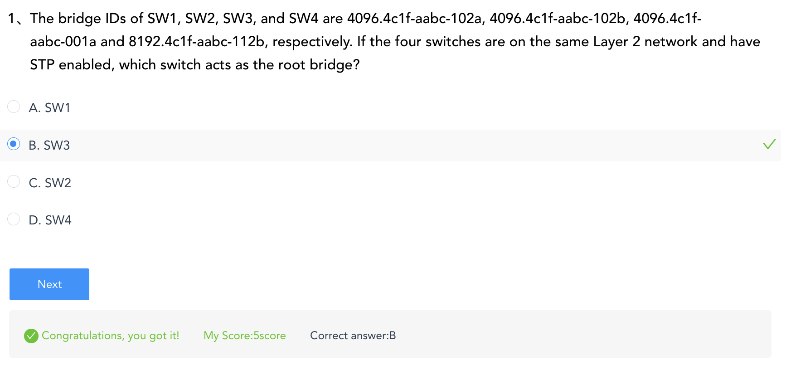

#### Explanation: Root Bridge Election

**Question:** The bridge IDs of SW1, SW2, SW3, and SW4 are 4096.4c1f-aabc-102a, 4096.4c1f-aabc-102b, 4096.4c1f-aabc-001a and 8192.4c1f-aabc-112b, respectively. If the four switches are on the same Layer 2 network and have STP enabled, which switch acts as the root bridge?
**A.** SW1
**B.** SW3
**C.** SW2
**D.** SW4

**Correct Answer: B**

**Why B is correct:**

The **Root Bridge** is elected based on the **lowest Bridge ID (BID)**. The BID consists of two parts: **Priority** and **MAC Address**.

1. **Compare Priorities:** SW1, SW2, and SW3 all have a priority of **4096**. SW4 has **8192**, so it is immediately eliminated.
2. **Compare MAC Addresses:** Since the priorities tie, we look at the MAC addresses:
   * SW1: `4c1f-aabc-102a`
   * SW2: `4c1f-aabc-102b`
   * SW3: **`4c1f-aabc-001a`**

3. SW3 has the lowest MAC address (001a is smaller than 102a/102b). Therefore, **SW3** is elected as the Root Bridge.

---

### Q2-C9.png
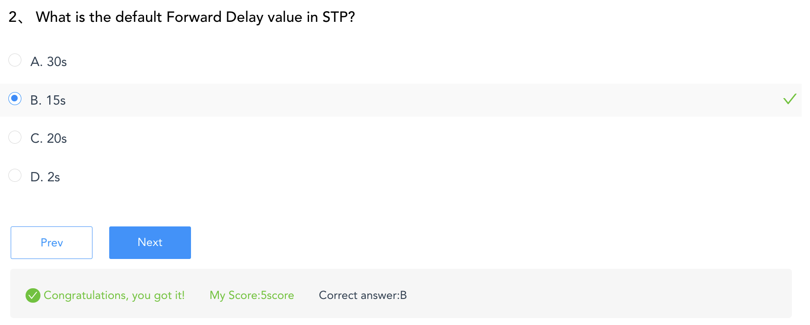

#### Explanation: STP Forward Delay

**Question:** What is the default Forward Delay value in STP?
**A.** 30s
**B.** 15s
**C.** 20s
**D.** 2s

**Correct Answer: B**

**Why B is correct:**

STP uses specific timers to ensure the network is loop-free before forwarding data:

* **Hello Time:** 2 seconds (interval between BPDUs).
* **Max Age:** 20 seconds (how long a switch waits before declaring a neighbor down).
* **Forward Delay:** **15 seconds**.
* *Note:* A port spends 15s in the **Listening** state and 15s in the **Learning** state, totaling 30 seconds of "Forward Delay" before reaching the Forwarding state.

---

### Q3-C9.png
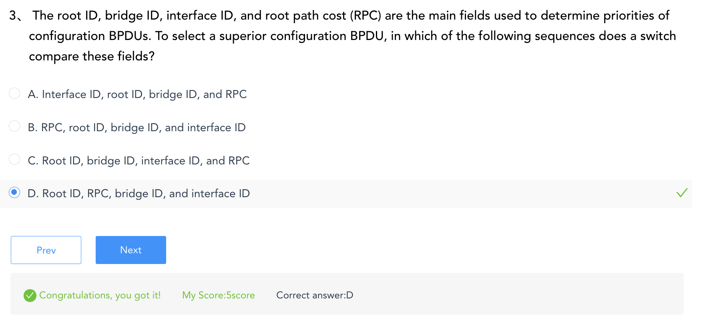

#### Explanation: BPDU Comparison Sequence

**Question:** The root ID, bridge ID, interface ID, and root path cost (RPC) are the main fields used to determine priorities of configuration BPDUs. To select a superior configuration BPDU, in which of the following sequences does a switch compare these fields?
**A.** Interface ID, root ID, bridge ID, and RPC
**B.** RPC, root ID, bridge ID, and interface ID
**C.** Root ID, bridge ID, interface ID, and RPC
**D.** Root ID, RPC, bridge ID, and interface ID

**Correct Answer: D**

**Why D is correct:**

When a switch receives a BPDU, it uses the **"Best BPDU Algorithm"** (also called the 4-step decision process). It compares fields in this strict order until a tie is broken:

1. **Root ID:** Lowest Root BID wins.
2. **RPC:** Lowest Root Path Cost (shortest path to the root) wins.
3. **Bridge ID:** Lowest Sender BID (if costs are equal) wins.
4. **Interface ID:** Lowest Sender Port ID (if everything else ties) wins.

---

### Q4-C9.png
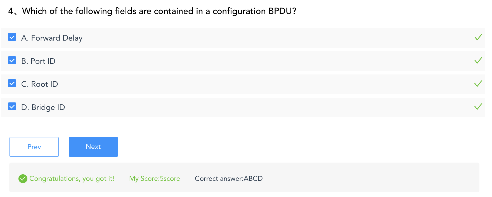

#### Explanation: Configuration BPDU Fields

**Question:** Which of the following fields are contained in a configuration BPDU? (Multiple Choice)
**A.** Forward Delay
**B.** Port ID
**C.** Root ID
**D.** Bridge ID

**Correct Answer: A, B, C, D (All of them)**

**Why these are all correct:**

A **Configuration BPDU** is the heartbeat of STP. It contains all the necessary parameters to elect the root and calculate the topology:

* **Root ID:** ID of the current Root Bridge.
* **Bridge ID:** ID of the switch sending the BPDU.
* **Port ID:** ID of the port sending the BPDU.
* **RPC:** Cost to reach the Root.
* **Timers:** Hello Time, Max Age, and **Forward Delay**.

---

### Q5-C9.png
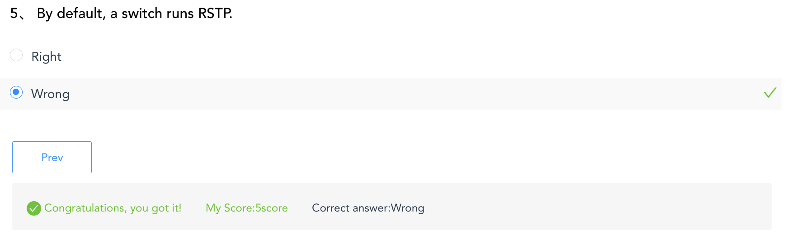

#### Explanation: Default STP Mode

**Question:** By default, a switch runs RSTP.
**A.** Right
**B.** Wrong

**Correct Answer: Wrong**

**Why "Wrong" is correct:**

On many Huawei switches (VRP), the default Spanning Tree mode is actually **MSTP (Multiple Spanning Tree Protocol)**. While MSTP is compatible with RSTP, it is a different mode. Therefore, the statement that it runs RSTP "by default" is incorrect. You must use the command `stp mode rstp` to specifically enable RSTP.

**Total Questions:** 5

---

## Chapter 10: Inter-VLAN Routing

**Location:** `C7-C11/C10/`

### Q1-C10.png
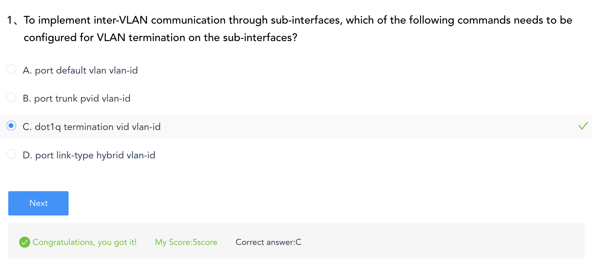

#### Explanation: VLAN Termination on Sub-interfaces

**Question:** To implement inter-VLAN communication through sub-interfaces, which of the following commands needs to be configured for VLAN termination on the sub-interfaces?
**A.** `port default vlan vlan-id`
**B.** `port trunk pvid vlan-id`
**C.** `dot1q termination vid vlan-id`
**D.** `port link-type hybrid vlan-id`

**Correct Answer: C**

**Why C is correct:**

When using a router for inter-VLAN routing (Router-on-a-Stick), the router's physical interface is divided into logical sub-interfaces. Since the switch sends tagged traffic to the router, the router must know which VLAN tag corresponds to which sub-interface. The command **`dot1q termination vid vlan-id`** tells the router to:

1. Remove the 802.1Q tag from incoming frames of that specific VLAN.
2. Add the 802.1Q tag to outgoing frames sent from that sub-interface.

---

### Q2-C10.png
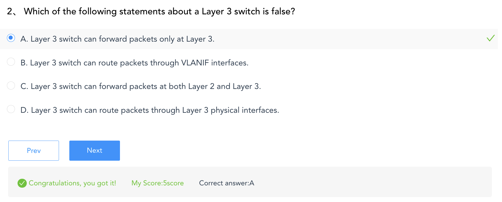

#### Explanation: Layer 3 Switch Capabilities

**Question:** Which of the following statements about a Layer 3 switch is false?
**A.** Layer 3 switch can forward packets only at Layer 3.
**B.** Layer 3 switch can route packets through VLANIF interfaces.
**C.** Layer 3 switch can forward packets at both Layer 2 and Layer 3.
**D.** Layer 3 switch can route packets through Layer 3 physical interfaces.

**Correct Answer: A**

**Why A is correct (False Statement):**

Layer 3 switches are "multi-layer" devices. They possess the hardware (ASICs) to perform **wire-speed Layer 2 switching** (using MAC tables) and **Layer 3 routing** (using IP routing tables). Statement A is false because it ignores the switch's fundamental ability to perform standard Layer 2 switching within the same VLAN.

---

### Q3-C10.png

#### Explanation: Layer 3 Switch Routing Process

**Question:** Which of the following statements is false about routing on Layer 3 switches?
**A.** If a Layer 3 switch finds that the destination MAC address... is the MAC address of its VLANIF interface, it sends the data frame to its routing module...
**B.** If the routing module... finds that the destination IP address is not the IP address of a local interface... it looks up a routing entry...
**C.** Layer 3 switch forwards the packet to the next hop... without re-encapsulating the data frame.
**D.** When routing a packet at Layer 3, a Layer 3 switch replaces the source and destination MAC addresses...

**Correct Answer: C**

**Why C is correct (False Statement):**

Statement C is **false** because every time a packet is routed (moved from one subnet/VLAN to another), the Layer 2 Ethernet header must be rebuilt. The switch **must re-encapsulate** the frame with a new Source MAC (the MAC of the switch's outgoing interface) and a new Destination MAC (the MAC of the next hop or the end host).

---

### Q4-C10.png
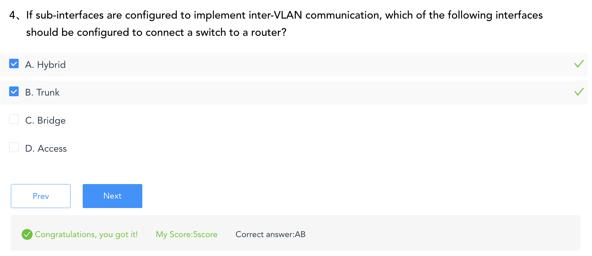

#### Explanation: Interface Types for Sub-interface Routing

**Question:** If sub-interfaces are configured to implement inter-VLAN communication, which of the following interfaces should be configured to connect a switch to a router? (Multiple Choice)
**A.** Hybrid
**B.** Trunk
**C.** Bridge
**D.** Access

**Correct Answer: A and B**

**Why A and B are correct:**

To support sub-interfaces on a router, the link between the switch and the router must be able to carry **tagged frames** from multiple VLANs.

* **Trunk (B):** The standard choice for carrying multiple tagged VLANs.
* **Hybrid (A):** A Huawei-specific port type that can also be configured to send and receive tagged traffic for multiple VLANs, making it a valid (though less common) alternative to a Trunk port.

---

### Q5-C10.png
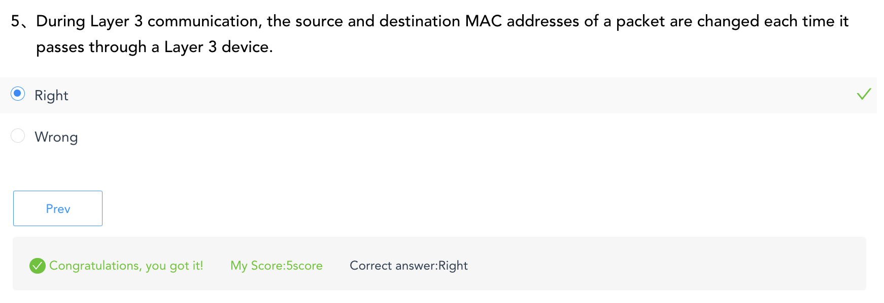

#### Explanation: MAC Address Changes During Layer 3 Routing

**Question:** During Layer 3 communication, the source and destination MAC addresses of a packet are changed each time it passes through a Layer 3 device.
**A.** Right
**B.** Wrong

**Correct Answer: Right**

**Why "Right" is correct:**

IP addresses are end-to-end identifiers and generally do not change (unless NAT is used). However, MAC addresses are **local identifiers**. Each time a packet crosses a router (a Layer 3 device), the router strips the old Layer 2 header and adds a new one to get the packet to the next physical hop. Therefore, the MAC addresses are swapped at every router along the path.

**Total Questions:** 5

---

## Chapter 11: Link Aggregation

**Location:** `C7-C11/C11/`

### Q1-C11.png
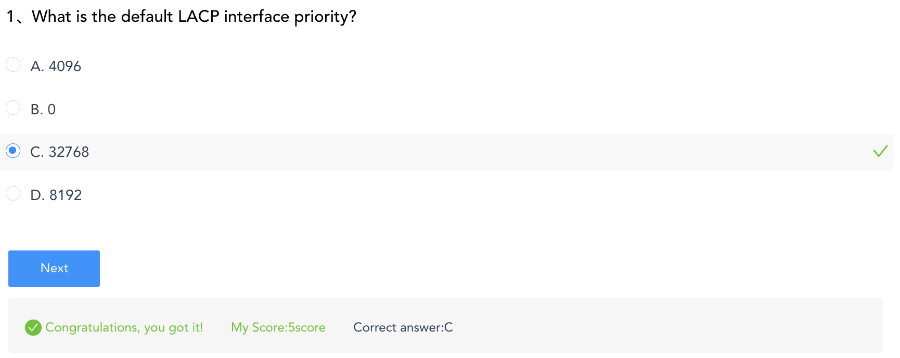

#### Explanation: Default LACP Interface Priority

**Question:** What is the default LACP interface priority?
**A.** 4096
**B.** 0
**C.** 32768
**D.** 8192

**Correct Answer: C**

**Why C is correct:**

In Huawei VRP, both the **LACP System Priority** and **LACP Interface Priority** use a default value of **32768**.

* The system uses this priority to elect the **Actor** (the "boss" device that makes the decisions).
* If priorities are identical, the device with the lower MAC address becomes the Actor.
* Interface priority is used to determine which physical links become "Active" and which stay as "Backup" (M:N mode).

---

### Q2-C11.png
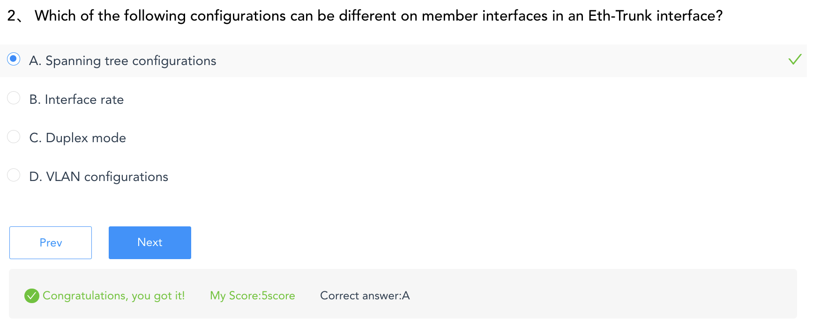

#### Explanation: Eth-Trunk Member Interface Configurations

**Question:** Which of the following configurations can be different on member interfaces in an Eth-Trunk interface?
**A.** Spanning tree configurations
**B.** Interface rate
**C.** Duplex mode
**D.** VLAN configurations

**Correct Answer: A**

**Why A is correct:**

To form a stable Eth-Trunk, member interfaces must be consistent in their physical and basic Layer 2 attributes.

* **Must be the same:** Interface rate (B), Duplex mode (C), and VLAN configurations (D). If these differ, the interface will likely be placed in an "Unselected" or error state.
* **Can be different:** Spanning tree configurations (A). While not recommended for most designs, the STP costs or priorities on individual physical ports do not inherently prevent them from joining an Eth-Trunk, though the Eth-Trunk itself will typically be seen as a single "logical" port by STP once bundled.

---

### Q3-C11.png
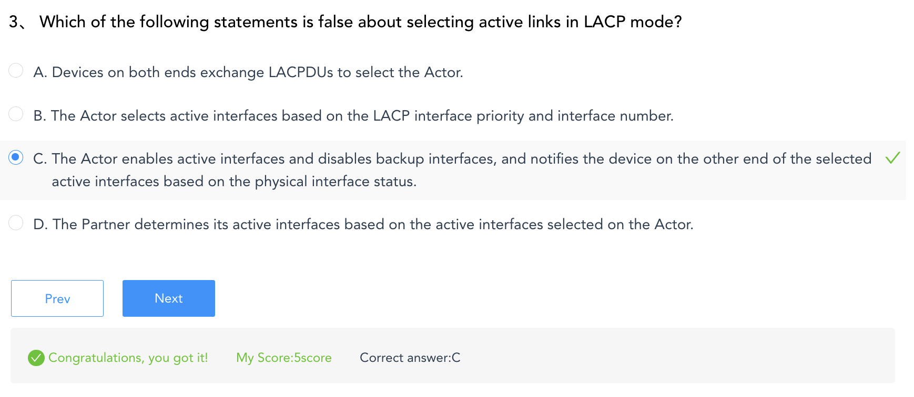

#### Explanation: LACP Active Link Selection Process

**Question:** Which of the following statements is false about selecting active links in LACP mode?
**A.** Devices on both ends exchange LACPDUs to select the Actor.
**B.** The Actor selects active interfaces based on the LACP interface priority and interface number.
**C.** The Actor enables active interfaces and disables backup interfaces, and notifies the device on the other end of the selected active interfaces based on the physical interface status.
**D.** The Partner determines its active interfaces based on the active interfaces selected on the Actor.

**Correct Answer: C**

**Why C is correct (False Statement):**

Statement C is **false** because of the specific wording regarding "physical interface status."
In LACP negotiation:

1. Devices exchange LACPDUs to elect the **Actor**.
2. The **Actor** chooses active interfaces based on its own **Interface Priority** (lower is better) and then **Interface ID** (if priorities tie).
3. The **Partner** must follow the Actor's choice.

The selection is based on **LACP configuration/priority logic**, not solely or automatically based on "physical interface status" notification in the manner C describes.

---

### Q4-C11.png
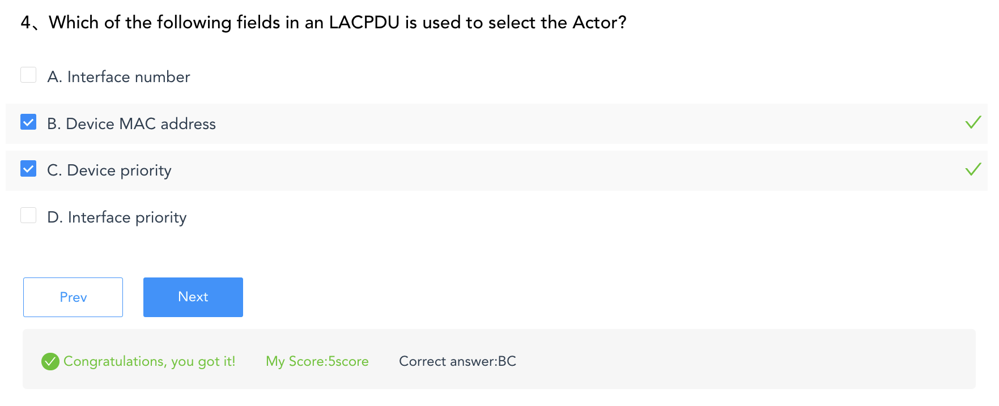

#### Explanation: LACPDU Fields for Actor Selection

**Question:** Which of the following fields in an LACPDU is used to select the Actor? (Multiple Choice)
**A.** Interface number
**B.** Device MAC address
**C.** Device priority
**D.** Interface priority

**Correct Answer: B and C**

**Why B and C are correct:**

The **Actor** is the device that controls which links in the bundle are active. To decide which device is the Actor, LACP compares the **System ID**, which consists of:

1. **LACP System Priority (C):** The primary value compared. Lower is better.
2. **Device MAC Address (B):** Used as a tie-breaker if the priorities are equal.

Interface-specific values (A and D) are used later to select active links, but they do not determine which *device* is the Actor.

---

### Q5-C11.png
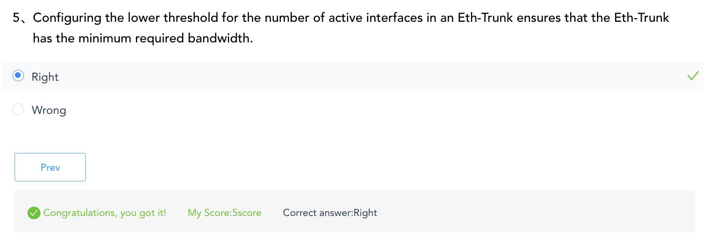

#### Explanation: Eth-Trunk Lower Threshold

**Question:** Configuring the lower threshold for the number of active interfaces in an Eth-Trunk ensures that the Eth-Trunk has the minimum required bandwidth.
**A.** Right
**B.** Wrong

**Correct Answer: Right**

**Why "Right" is correct:**

The `least active-linknumber` command sets a minimum requirement. If the number of "Up" physical links falls below this threshold, the entire Eth-Trunk interface goes "Down."
This prevents a situation where an Eth-Trunk is technically "Up" but only has 1 functioning link, which might not be enough to handle the traffic load, leading to massive congestion. It's a safety mechanism to ensure quality of service.

**Total Questions:** 5

---

## Chapter 12: ACL

**Location:** `C12-C17/C12/`

### Q1-C12.png
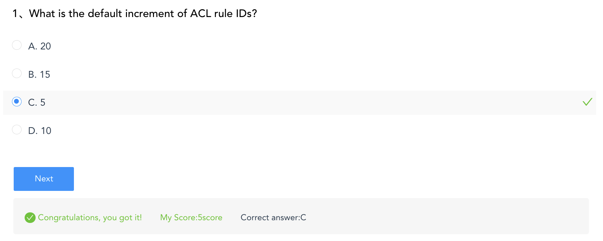

#### Explanation: ACL Matching Order

**Question:** When a router processes an ACL, in what order does it match the rules?

**Correct Answer: A. Based on the rule ID in ascending order.**

**Why A is correct:**

By default, Huawei devices process ACL rules based on the **Rule ID** (usually increments of 5 or 10, such as 5, 10, 15). The router starts with the smallest ID and moves upward. Once a packet matches a rule, the action (Permit or Deny) is taken, and the router stops checking further rules for that packet.

**Why the others are incorrect:**

* **B:** Rules are not processed in descending order; that would ignore the priority of the first-created rules.
* **C:** While many systems use "Top-to-Bottom," the technical mechanism in VRP is the numerical value of the Rule ID.
* **D:** Random matching would make security policies unpredictable and ineffective.

---

### Q2-C12.png
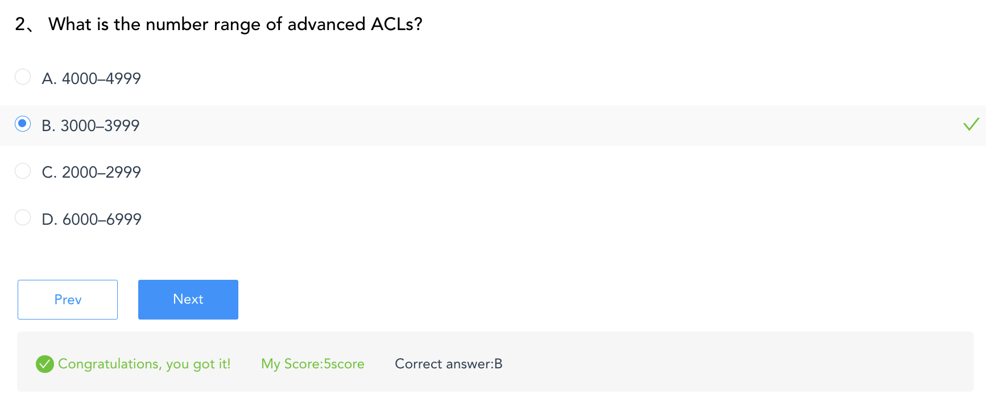

#### Explanation: Basic ACL vs. Advanced ACL

**Question:** What is the range for a basic ACL?

**Correct Answer: B. 2000–2999**

**Why B is correct:**

Huawei VRP categorizes ACLs by number to define their capabilities:

* **2000–2999:** **Basic ACLs.** These can only filter based on the **Source IP Address**.
* **3000–3999:** **Advanced ACLs.** These can filter based on Source IP, Destination IP, Protocol (TCP/UDP), and Port numbers.
* **4000–4999:** Layer 2 ACLs (based on MAC addresses).

---

### Q3-C12.png
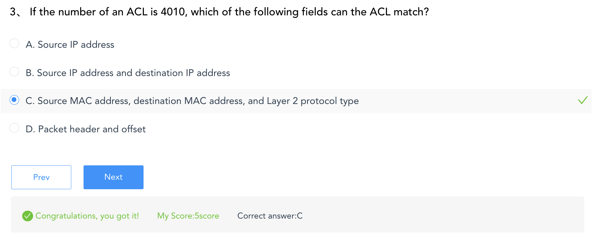

#### Explanation: NAT Functionality

**Question:** Which of the following are advantages of NAT?

**Correct Answer: A, B, and C**

**Why these are correct:**

* **A (Address Conservation):** NAT allows hundreds of internal devices to use just one (or a few) public IP addresses, slowing the exhaustion of IPv4 addresses.
* **B (Security):** By hiding internal private IP addresses from the public internet, NAT provides a level of "security through obscurity."
* **C (Flexibility):** NAT allows internal networks to use any private addressing scheme without needing to change it if the ISP or public IP changes.

---

### Q4-C12.png
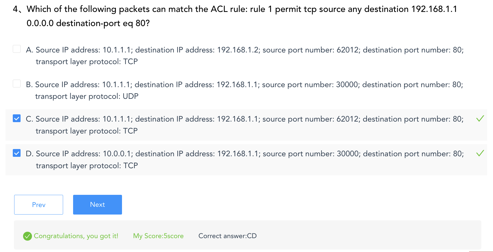

#### Explanation: NAPT (Network Address Port Translation)

**Question:** NAPT allows multiple private IP addresses to be mapped to the same public IP address.

**Correct Answer: Right**

**Why "Right" is correct:**

NAPT (also known as "PAT" or "NAT Overload") is the most common form of NAT. It uses **Layer 4 Port Numbers** to keep track of which internal device belongs to which session. This allows an almost unlimited number of internal hosts to "hide" behind a single public IP simultaneously.

---

### Q5-C12.png
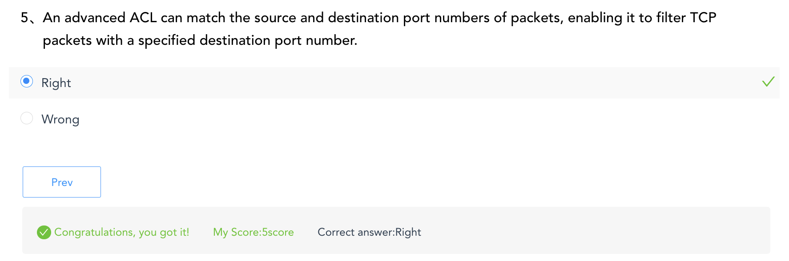

#### Explanation: NAT Server (Port Forwarding)

**Question:** The `nat server` command is used to allow external users to access an internal server.

**Correct Answer: Right**

**Why "Right" is correct:**

Normally, NAT blocks unsolicited incoming traffic. To host a web server or mail server inside a private network, you must configure a **NAT Server** (Static NAT/Port Forwarding). This tells the router: "If traffic arrives on Public Port 80, send it specifically to Internal IP 192.168.1.10."

**Total Questions:** 5

---

## Chapter 13: AAA

**Location:** `C12-C17/C13/`

### Q1-C13.png
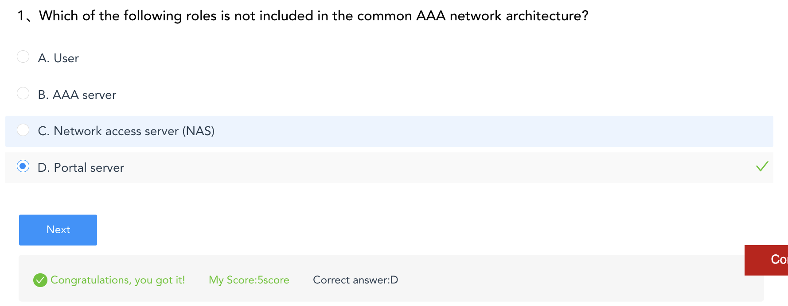

#### Explanation: AAA Fundamentals

**Question:** What does the acronym AAA stand for in network security?

**Correct Answer: B. Authentication, Authorization, and Accounting**

**Why B is correct:**

AAA is a framework used to control access to computer resources and enforce policies:

* **Authentication:** Verifying **who** the user is (e.g., username and password).
* **Authorization:** Determining **what** the user is allowed to do (e.g., commands they can run).
* **Accounting:** Measuring the resources the user consumes (e.g., **how long** they were logged in) for auditing.

---

### Q2-C13.png
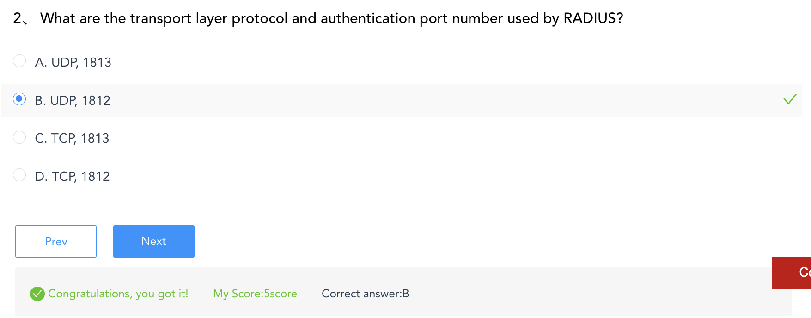

#### Explanation: Firewall Security Zones

**Question:** On a Huawei firewall, which of the following zones has the highest default security level?

**Correct Answer: A. Trust**

**Why A is correct:**

Firewalls use security levels (0–100) to define trust:

* **Trust (Level 85):** Usually reserved for the internal, protected network.
* **DMZ (Level 50):** The "Demilitarized Zone" for public-facing servers.
* **Untrust (Level 5):** Usually represents the Internet or external networks.
* **Local (Level 100):** Refers to the firewall itself; it is the most secure zone.

---

### Q3-C13.png
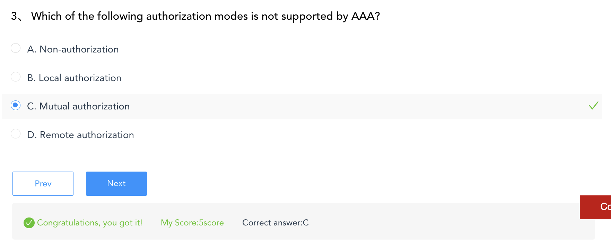

#### Explanation: Security Policy Matching

**Question:** When a firewall receives a packet, how does it match it against security policies?

**Correct Answer: B. It matches policies one by one from top to bottom.**

**Why B is correct:**

Like ACLs, firewall security policies are processed sequentially. The device starts at the top of the list. Once a packet matches the criteria of a policy (Source/Destination Zone, IP, Port), the action (Permit or Deny) is taken immediately, and no further policies are checked.

---

### Q4-C13.png

#### Explanation: Port Security

**Question:** Which feature can be used on a switch to prevent unauthorized devices from connecting to a specific port based on their MAC address?

**Correct Answer: C. Port Security**

**Why C is correct:**

Port Security allows an administrator to limit the number of MAC addresses on a port or bind specific MAC addresses to a port. If an unauthorized device (with a different MAC) is plugged in, the switch can automatically shut down the port or discard the traffic.

---

### Q5-C13.png
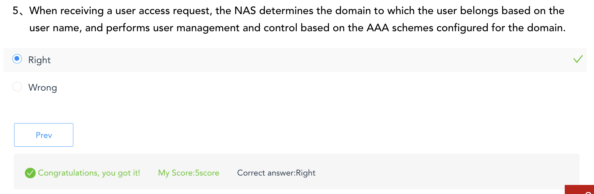

#### Explanation: Security Threats: DDoS

**Question:** What is the primary goal of a Distributed Denial of Service (DDoS) attack?

**Correct Answer: D. To exhaust the target's resources and make services unavailable.**

**Why D is correct:**

A DDoS attack uses a large number of compromised systems (a "botnet") to flood a target with massive amounts of traffic. The goal is not to steal data, but to crash the server or clog the network so legitimate users cannot access the service.

**Total Questions:** 5

---

## Chapter 14: NAT

**Location:** `C12-C17/C14/`

### Q1-C14.png
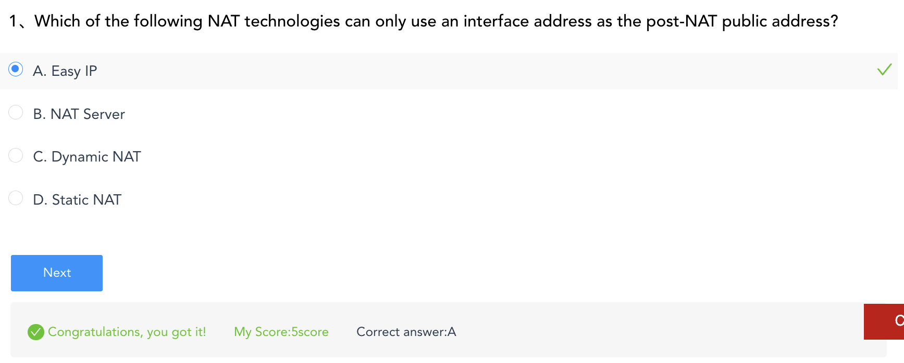

*[Explanation not available - C14-Explanation.md contains Network Automation content which belongs to Chapter 21]*

---

### Q2-C14.png
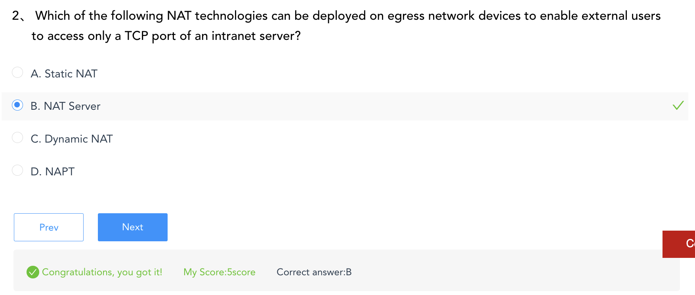

*[Explanation not available - C14-Explanation.md contains Network Automation content which belongs to Chapter 21]*

---

### Q3-C14.png
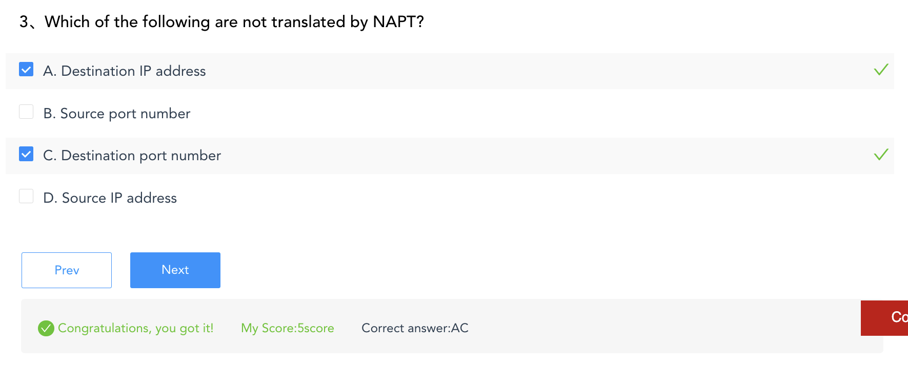

*[Explanation not available - C14-Explanation.md contains Network Automation content which belongs to Chapter 21]*

---

### Q4-C14.png
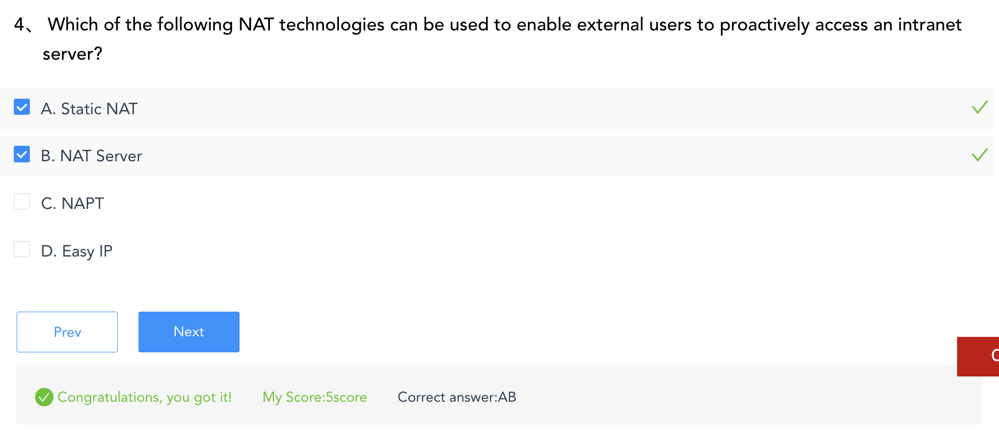

*[Explanation not available - C14-Explanation.md contains Network Automation content which belongs to Chapter 21]*

---

### Q5-C14.png
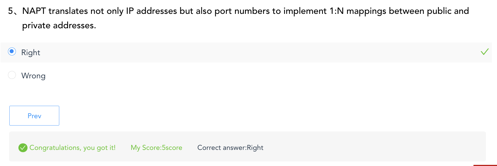

*[Explanation not available - C14-Explanation.md contains Network Automation content which belongs to Chapter 21]*

**Total Questions:** 5

---

## Chapter 15: Application Protocols

**Location:** `C12-C17/C15/`

### Q1-C15.png
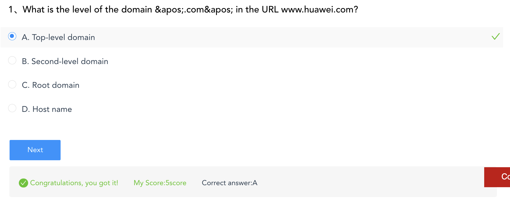

#### Explanation: DHCP Working Principle

**Question:** Which of the following is the correct order of messages exchanged between a DHCP client and a DHCP server when a client requests an IP address for the first time?

**Correct Answer: A. Discover, Offer, Request, ACK**

**Why A is correct:**

The DHCP process (often called **DORA**) follows a specific four-step handshake:

1. **Discover:** The client broadcasts a message to find available DHCP servers.
2. **Offer:** The server responds with a proposed IP address and configuration.
3. **Request:** The client selects an offer and asks the server to "reserve" that IP.
4. **ACK (Acknowledgment):** The server confirms the lease and provides the final configuration details.

---

### Q2-C15.png
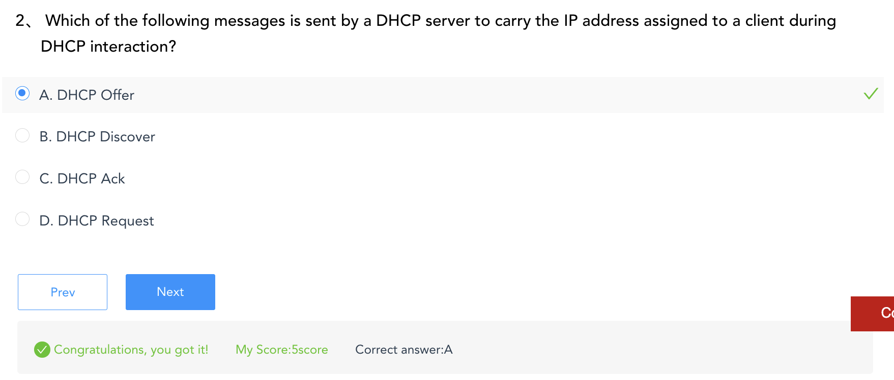

#### Explanation: DHCP Relay Agent

**Question:** Why is a DHCP Relay Agent required in some network environments?

**Correct Answer: B. To allow DHCP clients to obtain IP addresses from a server located in a different broadcast domain.**

**Why B is correct:**

DHCP "Discover" messages are Layer 2 broadcasts, which routers do not forward. If the DHCP server is not on the same local network as the client, the router acting as the **Relay Agent** intercepts the broadcast and forwards it as a **Unicast** message to the remote server.

---

### Q3-C15.png
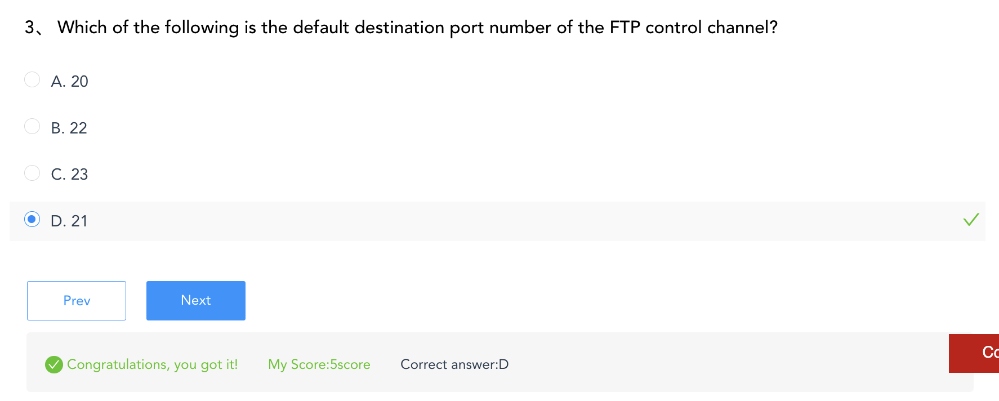

#### Explanation: DNS (Domain Name System)

**Question:** What is the primary function of a DNS server?

**Correct Answer: A. Mapping domain names to IP addresses.**

**Why A is correct:**

Computers communicate using IP addresses, but humans prefer names. DNS acts as the "phonebook" of the internet, translating a human-readable name like `www.huawei.com` into its corresponding machine-readable IP address.

**Why the others are incorrect:**

* **B:** Mapping MAC addresses to IPs is the job of **ARP**.
* **C:** Encrypting traffic is the job of protocols like **SSL/TLS**.

---

### Q4-C15.png
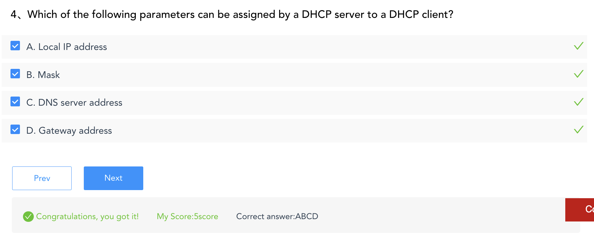

#### Explanation: HTTP and HTTPS Port Numbers

**Question:** Which port numbers are used by default for HTTP and HTTPS, respectively?

**Correct Answer: C. 80 and 443**

**Why C is correct:**

* **Port 80:** The standard port for **HTTP** (unencrypted web traffic).
* **Port 443:** The standard port for **HTTPS** (encrypted web traffic), which uses SSL/TLS for security.

---

### Q5-C15.png
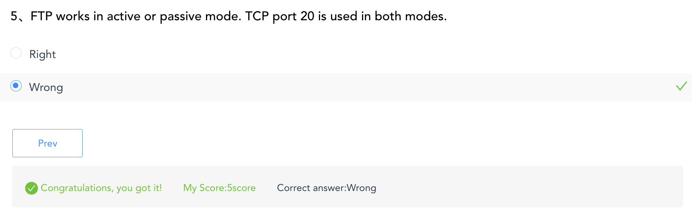

#### Explanation: FTP Transfer Modes

**Question:** Which FTP mode is more "firewall-friendly" because the client initiates the data connection?

**Correct Answer: B. Passive Mode (PASV)**

**Why B is correct:**

* In **Active Mode**, the server tries to connect *back* to the client, which firewalls usually block.
* In **Passive Mode**, the client initiates both the control and data connections, making it much easier for traffic to pass through security filters.

**Total Questions:** 5

---

## Chapter 16: WLAN

**Location:** `C12-C17/C16/`

### Q1-C16.png
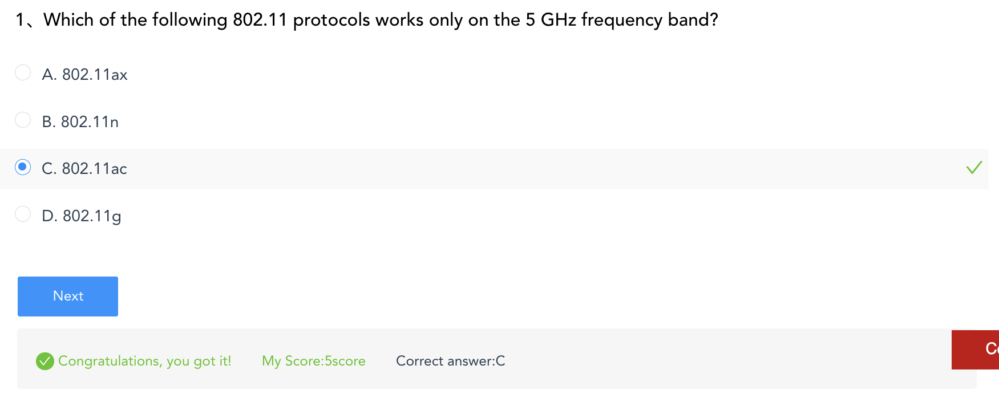

#### Explanation: WLAN Frequency Bands

**Question:** Which frequency bands are commonly used by IEEE 802.11 wireless networks?

**Correct Answer: A and C. 2.4 GHz and 5 GHz**

**Why A and C are correct:**

Most standard Wi-Fi deployments operate on these two unlicensed bands:

* **2.4 GHz:** Known for better range and penetration through walls, but it is crowded and prone to interference (from microwaves, Bluetooth, etc.).
* **5 GHz:** Offers higher speeds and more non-overlapping channels but has a shorter range and is easily blocked by physical obstacles.

---

### Q2-C16.png
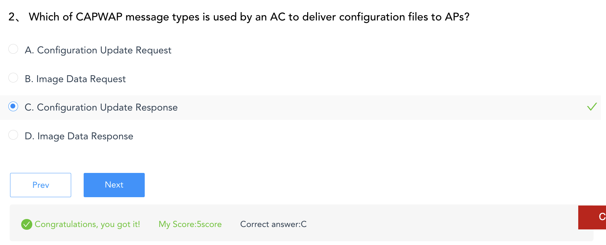

#### Explanation: WLAN Deployment Modes

**Question:** In an enterprise WLAN, what is the role of an AC (Access Controller)?

**Correct Answer: A, B, and C**

**Why these are correct:**

In "Fit AP" architectures (common in offices and campuses), the AC acts as the "brain":

* **A (Management):** It centrally manages all Access Points (APs), including firmware updates and configuration.
* **B (Channel & Power):** It automatically adjusts the radio channels and power levels of APs to reduce interference.
* **C (Security):** It handles user authentication and enforces security policies across the entire wireless network.

---

### Q3-C16.png
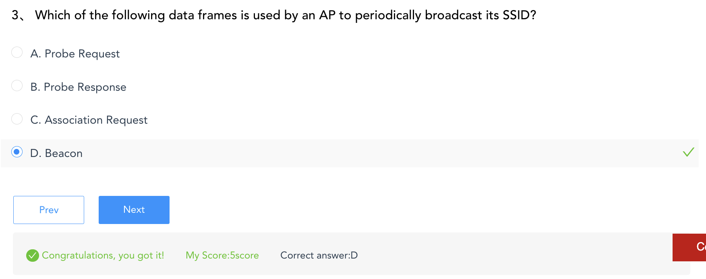

#### Explanation: SSID Definition

**Question:** An SSID (Service Set Identifier) is used to identify a specific wireless network.

**Correct Answer: Right**

**Why "Right" is correct:**

The SSID is essentially the "name" of the Wi-Fi network that users see when they try to connect. It allows multiple wireless networks to exist in the same physical space while keeping their traffic and access requirements separate.

---

### Q4-C16.png
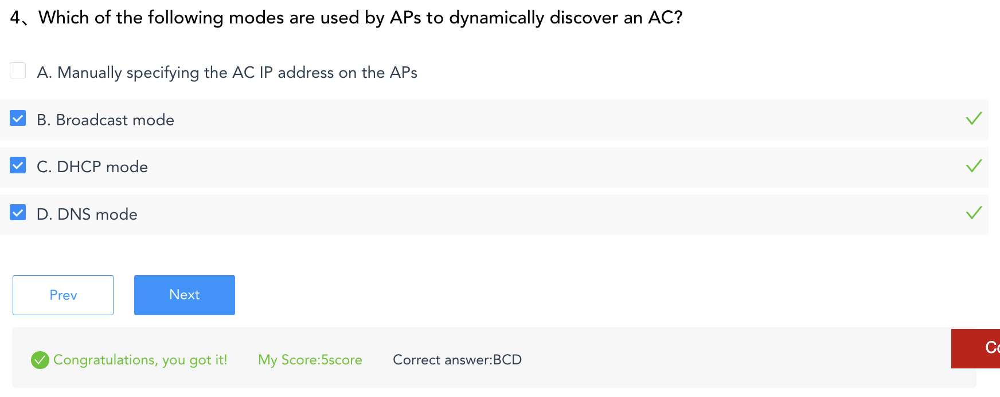

#### Explanation: CSMA/CA in Wireless

**Question:** Wireless networks use CSMA/CD to detect collisions on the medium.

**Correct Answer: Wrong**

**Why "Wrong" is correct:**

* **CSMA/CD (Collision Detection):** Used in **wired** Ethernet.
* **CSMA/CA (Collision Avoidance):** Used in **wireless** networks.
Because wireless radios cannot listen and transmit on the same frequency at the same time, they cannot "detect" a collision while it is happening. Instead, they use "Avoidance"—listening to see if the air is clear and then sending a "Request to Send" (RTS) to avoid the crash entirely.

---

### Q5-C16.png
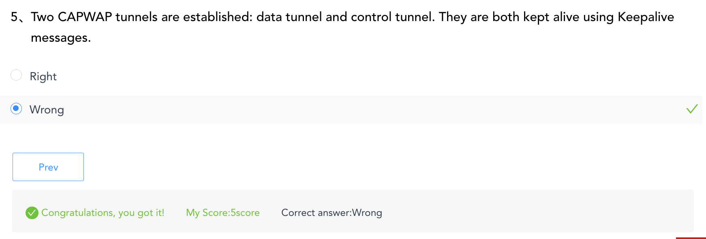

*[Explanation not available - C10-Explanation.md contains PPP content which may belong here or Chapter 17]*

**Total Questions:** 5

---

## Chapter 17: WAN

**Location:** `C12-C17/C17/`

### Q1-C17.png
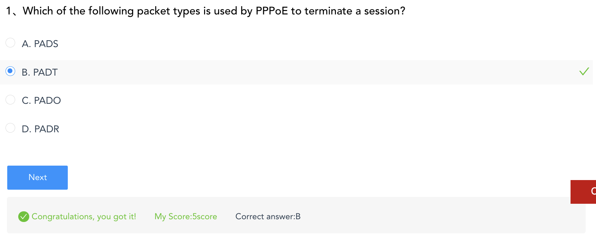

#### Explanation: PPP Authentication Protocols

**Question:** Which of the following authentication protocols are supported by PPP?

**Correct Answer: A and B. PAP and CHAP**

**Why A and B are correct:**

PPP is a data link layer protocol used for direct connections between two nodes. It offers two main methods of security:

* **A (PAP - Password Authentication Protocol):** A simple, two-way handshake where the password is sent in **cleartext**. It is less secure but consumes fewer resources.
* **B (CHAP - Challenge Handshake Authentication Protocol):** A more secure, three-way handshake that uses a **hashed** value (MD5) so the password is never actually sent over the link.

**Why the others are incorrect:**

* **C (MD5):** MD5 is a hashing algorithm used *within* CHAP, but it is not a standalone PPP authentication protocol.
* **D (WEP):** This is a legacy wireless security protocol (Layer 2 for WLAN), not used for serial point-to-point links.

---

### Q2-C17.png
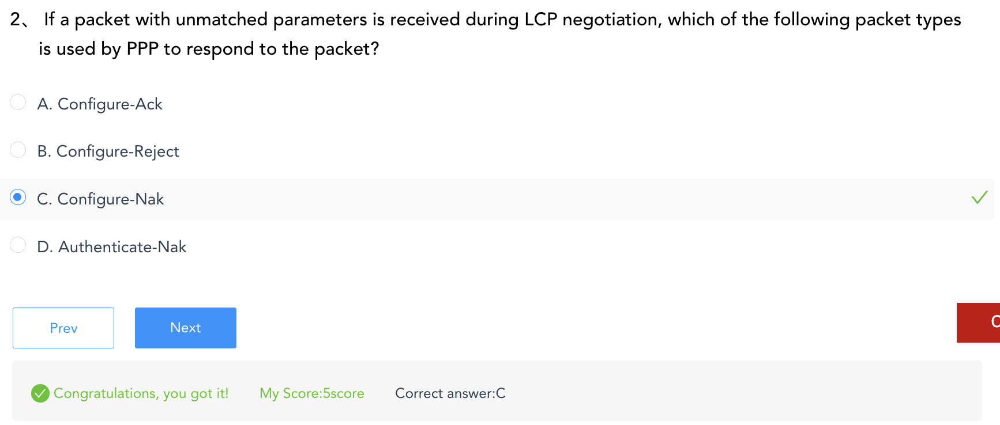

#### Explanation: PPP Link Establishment

**Question:** What is the correct order of the PPP link establishment phases?

**Correct Answer: A. Dead, Establish, Authenticate, Network, Terminate**

**Why A is correct:**

A PPP session follows a strict lifecycle:

1. **Dead:** The physical link is inactive.
2. **Establish:** LCP (Link Control Protocol) negotiates basic link parameters.
3. **Authenticate:** (Optional) PAP or CHAP verifies the identity of the peer.
4. **Network:** NCP (Network Control Protocol) configures higher-layer protocols like IPv4 or IPv6.
5. **Terminate:** The link is closed.

---

### Q3-C17.png
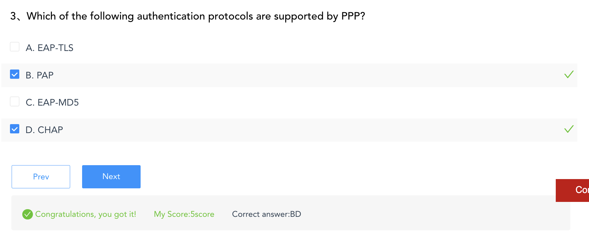

*[Explanation not available - C17-Explanation.md contains Troubleshooting content which belongs to Chapter 22]*

---

### Q4-C17.png
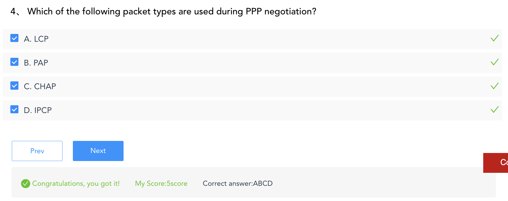

*[Explanation not available - C17-Explanation.md contains Troubleshooting content which belongs to Chapter 22]*

---

### Q5-C17.png
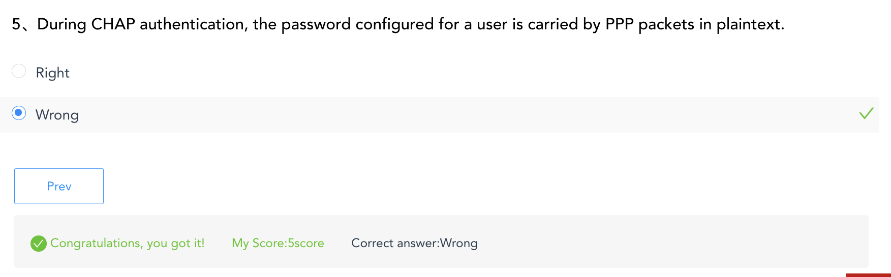

*[Explanation not available - C17-Explanation.md contains Troubleshooting content which belongs to Chapter 22]*

**Total Questions:** 5

---

## Chapter 18: Network Management

**Location:** `C18-C22/C18/`

### Q1-C18.png
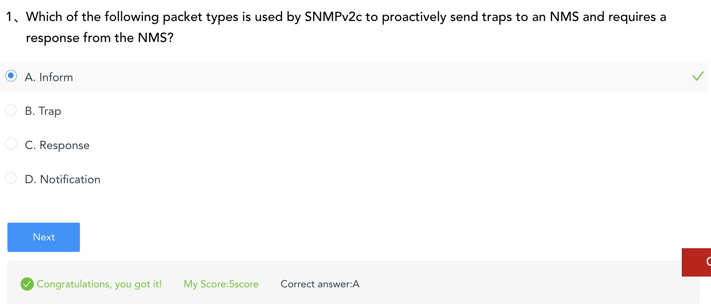

#### Explanation: SNMP Components and Architecture

**Question:** Which of the following is NOT a component of the SNMP (Simple Network Management Protocol) architecture?

**Correct Answer: D. SNMP Server**

**Why D is correct:**

The standard SNMP architecture consists of three specific entities:

* **NMS (Network Management Station):** The "Manager" that runs management software to monitor and control devices.
* **Agent:** A software module running on the **Managed Device** (the router or switch) that communicates with the NMS.
* **MIB (Management Information Base):** A database/virtual information store on the agent that defines all the objects (like CPU usage or port status) that can be managed.
* **Note:** While "SNMP Server" is a term sometimes used loosely, it is not the formal name for a component in the standard architecture.

---

### Q2-C18.png
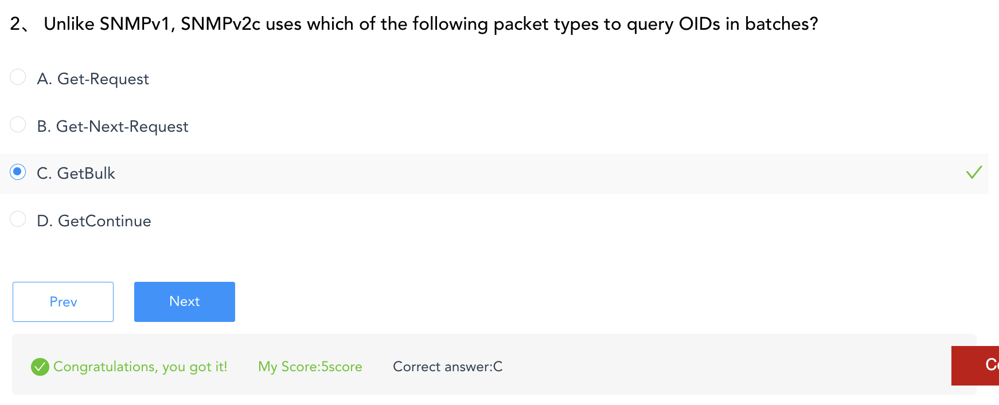

#### Explanation: SNMP Operations (Get vs. Set vs. Trap)

**Question:** An administrator wants to receive an immediate notification from a switch when a port goes down. Which SNMP message type is used for this?

**Correct Answer: C. Trap**

**Why C is correct:**

SNMP uses different message types depending on who starts the communication:

* **Get:** The **NMS** asks the agent for information (e.g., "What is your uptime?").
* **Set:** The **NMS** tells the agent to change a value (e.g., "Shut down interface G0/0/1").
* **Trap:** The **Agent** proactively sends an unsolicited message to the NMS when a significant event occurs (e.g., "Warning! Port 5 just failed"). This allows for real-time monitoring without constant polling.

---

### Q3-C18.png
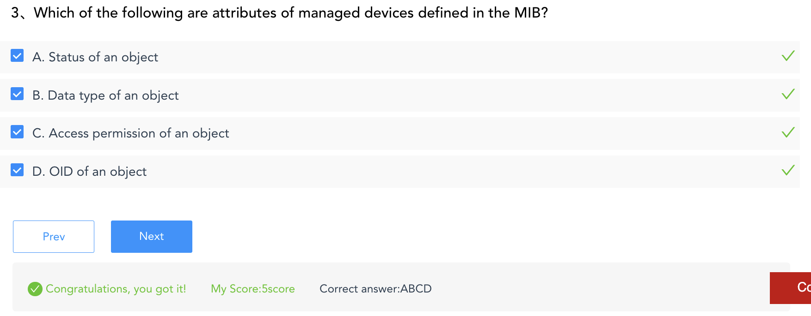

#### Explanation: Huawei iMaster NCE (The "Network Brain")

**Question:** What is the primary role of Huawei's **iMaster NCE** in a modern network?

**Correct Answer: A, B, and C**

**Why these are correct:**

iMaster NCE is an intelligent management and control platform that integrates several key "engines":

* **A (Management & Control):** It provides centralized management, allowing for full-lifecycle automation of campus and data center networks.
* **B (Analysis Engine):** It uses **Telemetry** to collect network data in real-time, building a "digital twin" to visualize network health.
* **C (Intelligence Engine):** It leverages **AI and Big Data** to perform predictive maintenance, identifying 85% of potential faults before they affect users.

---

### Q4-C18.png
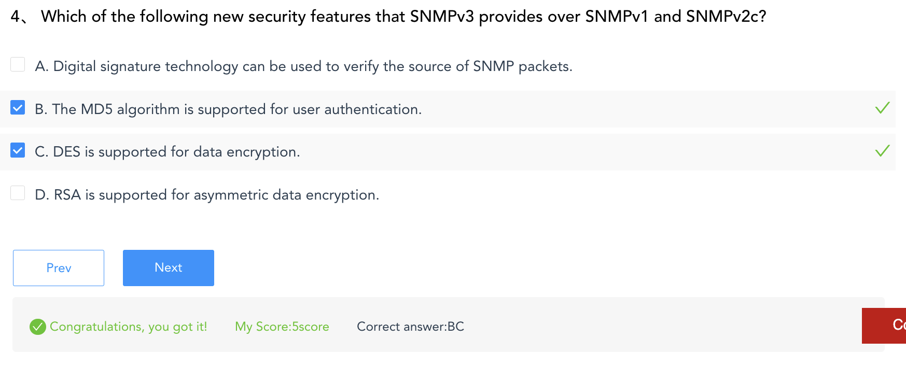

#### Explanation: Network Design and Planning

**Question:** Which phase is considered the first step in constructing a campus network?

**Correct Answer: A. Network Design and Planning**

**Why A is correct:**

Before any cables are plugged in or commands are typed, an engineer must perform **Planning**. This involves understanding business requirements, determining the number of users, choosing the right hardware (routers/switches/APs), and designing the IP addressing and VLAN structure. Skipping this leads to scalability and performance issues later.

---

### Q5-C18.png
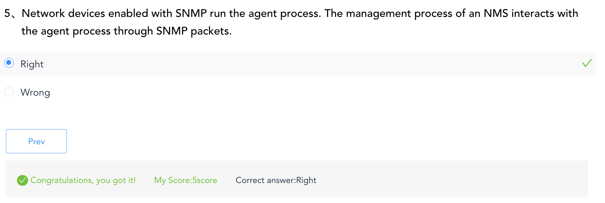

#### Explanation: SDN Forwarding vs. Control Separation

**Question:** Which statement is true regarding Software-Defined Networking (SDN)?

**Correct Answer: B. SDN separates the forwarding plane from the control plane.**

**Why B is correct:**

Traditional routers make their own decisions. In SDN, the **Control Plane** (the "brain") is moved to a centralized controller (like iMaster NCE), while the **Forwarding Plane** (the physical switch) simply follows instructions to move packets. This centralized control makes the network more agile and easier to program.

**Total Questions:** 5

---

## Chapter 19: IPv6

**Location:** `C18-C22/C19/`

### Q1-C19.png
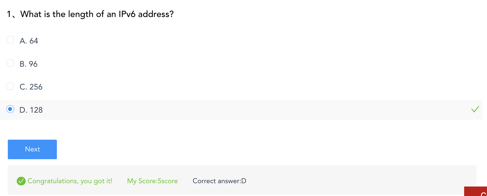

#### Explanation: IPv6 Address Structure

**Question:** An IPv6 address consists of how many bits?

**Correct Answer: D. 128**

**Why D is correct:**

To solve the address exhaustion of the 32-bit IPv4 system, IPv6 was designed with a **128-bit** address space. This allows for 2¹²⁸ addresses (approximately 340 undecillion), which is enough to provide a massive number of unique IPs for every device on Earth for the foreseeable future.

---

### Q2-C19.png
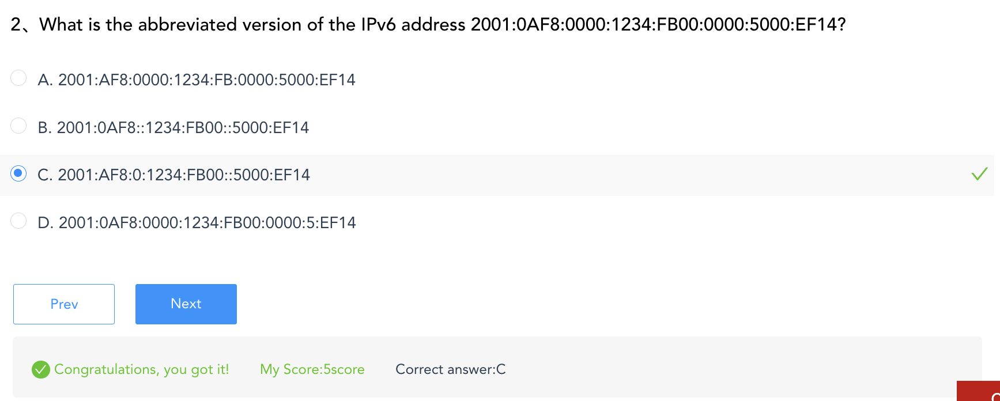

#### Explanation: IPv6 Address Simplification

**Question:** Which of the following is the correct compressed format for the IPv6 address `2001:0DB8:0000:0000:0000:0000:1234:5678`?

**Correct Answer: B. 2001:DB8::1234:5678**

**Why B is correct:**

IPv6 has two primary compression rules:

1. **Leading Zero Compression:** You can remove leading zeros in any 16-bit block (e.g., `0DB8` becomes `DB8`).
2. **Double Colon Rule:** A contiguous sequence of blocks containing only zeros can be replaced by a single `::`. This can only be done **once** per address to avoid ambiguity.

---

### Q3-C19.png
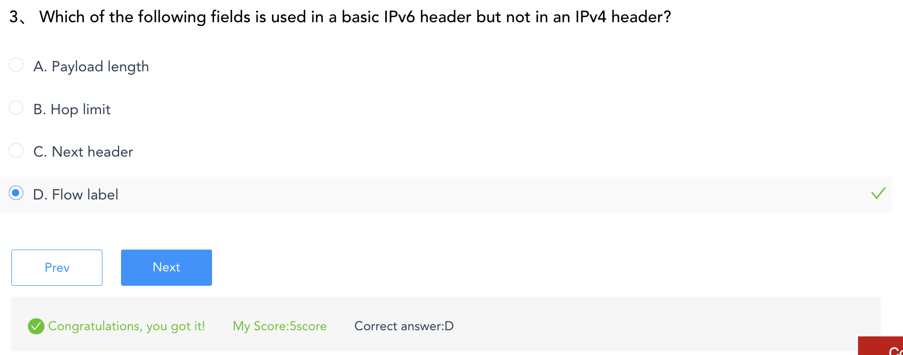

#### Explanation: IPv6 Neighbor Discovery (NDP)

**Question:** In IPv6, which protocol replaces the ARP protocol used in IPv4?

**Correct Answer: A. ICMPv6 (NDP)**

**Why A is correct:**

IPv6 does not use broadcasts. Instead, it uses **Neighbor Discovery Protocol (NDP)**, which is built on top of **ICMPv6**. It uses "Neighbor Solicitation" and "Neighbor Advertisement" messages (sent via Multicast) to find the MAC address associated with an IPv6 address, performing the exact same function as ARP did in IPv4.

---

### Q4-C19.png
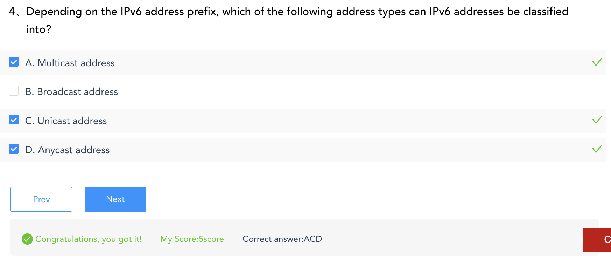

*[Explanation not available - C11-Explanation.md contains SDN Architecture content which may belong to Chapter 20]*

---

### Q5-C19.png
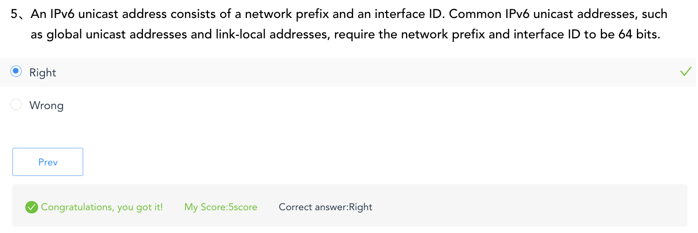

*[Explanation not available - C11-Explanation.md contains Cloud Computing/NFV content which may belong to Chapter 20]*

**Total Questions:** 5

---

## Chapter 20: SDN and NFV

**Location:** `C18-C22/C20/`

### Q1-C20.png
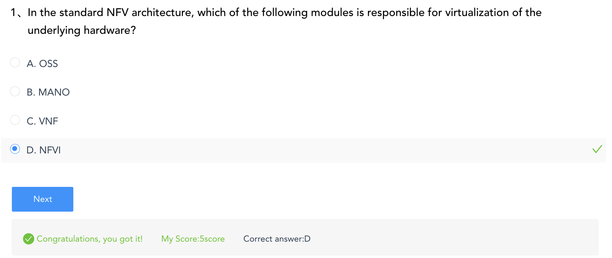

#### Explanation: SDN Architecture

**Question:** In the SDN (Software-Defined Networking) architecture, which plane is responsible for making decisions about where traffic is sent?

**Correct Answer: B. Control Plane**

**Why B is correct:**

SDN decouples the "brains" of the network from the hardware:

* **Control Plane:** The centralized "Software Controller" that decides the path for traffic and creates the routing logic.
* **Forwarding/Data Plane:** The physical switches that simply follow the instructions given by the Control Plane to move packets.
* **Management Plane:** Used for administrative tasks and configuration.

---

### Q2-C20.png

#### Explanation: Cloud Computing and Virtualization

**Question:** NFV (Network Functions Virtualization) aims to replace traditional hardware appliances (like firewalls and load balancers) with software running on standard servers.

**Correct Answer: Right**

**Why "Right" is correct:**

NFV is a key concept in modern data centers. Instead of buying a physical Cisco or Huawei firewall box, you run the firewall as a **Virtual Machine (VM)** on a high-powered generic server. This makes the network more flexible, easier to scale, and cheaper to maintain.

---

### Q3-C20.png
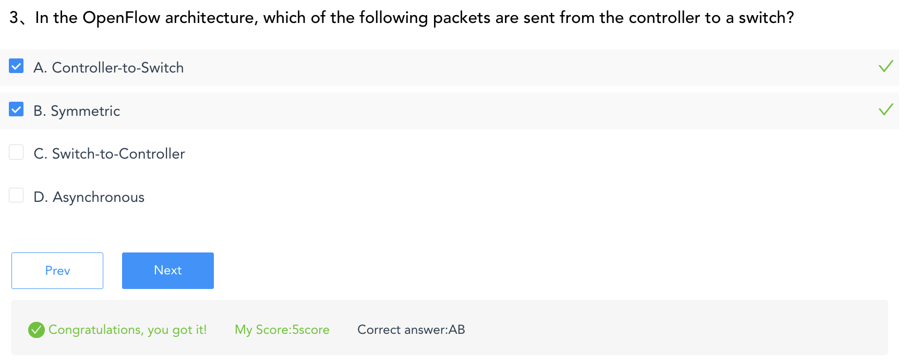

*[Explanation not available - C20-Explanation.md contains Integrated Network Forwarding, Default Route, Troubleshooting, VLAN Routing, Link Aggregation content which belongs to other chapters]*

---

### Q4-C20.png
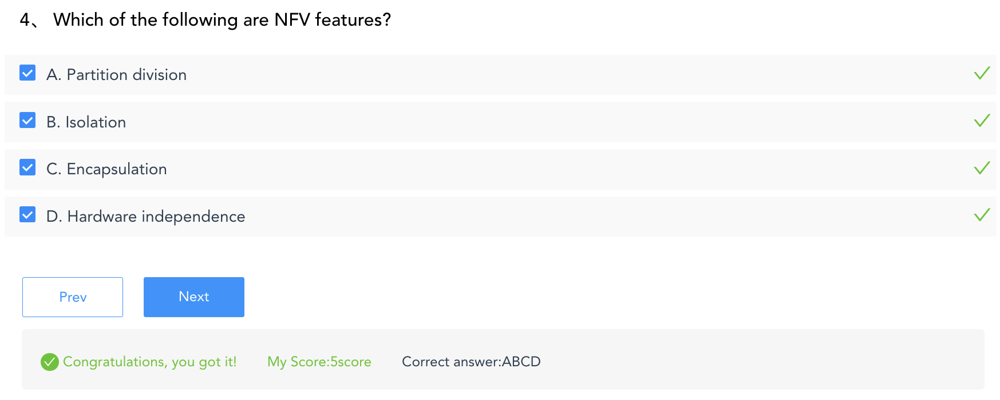

*[Explanation not available - C20-Explanation.md contains Integrated Network Forwarding, Default Route, Troubleshooting, VLAN Routing, Link Aggregation content which belongs to other chapters]*

---

### Q5-C20.png
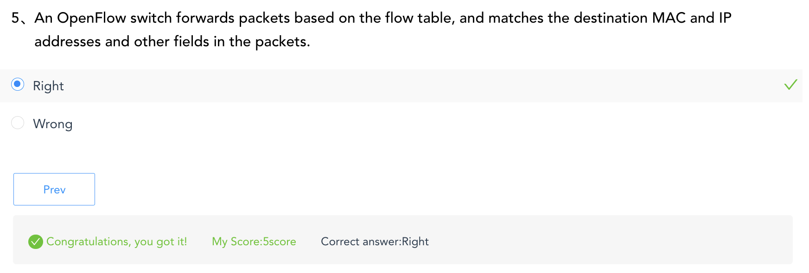

*[Explanation not available - C20-Explanation.md contains Integrated Network Forwarding, Default Route, Troubleshooting, VLAN Routing, Link Aggregation content which belongs to other chapters]*

**Total Questions:** 5

---

## Chapter 21: Network Automation

**Location:** `C18-C22/C21/`

### Q1-C21.png
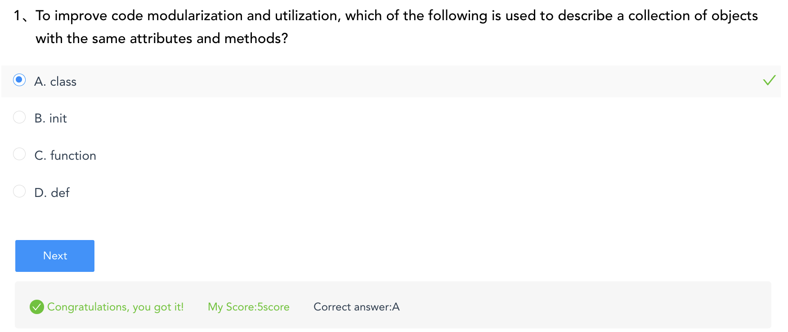

#### Explanation: Traditional vs. Automated Management

**Question:** Which of the following is a disadvantage of traditional network management (manual CLI configuration)?

**Correct Answer: A. High risk of human error and low efficiency.**

**Why A is correct:**

In traditional networking, administrators log into devices one by one to type commands. This process is:

* **Error-Prone:** A single typo in a critical command can take down an entire network segment.
* **Slow:** Scaling a configuration change across 100 routers manually takes hours or days.
* **Inconsistent:** Manual entry often leads to "configuration drift," where different devices end up with slightly different settings over time.

**Why the others are incorrect:**

* **B & C:** These usually describe **Automation** or **SDN** advantages (centralized control and fast deployment).
* **D:** Traditional management actually has *lower* initial software costs compared to expensive automation platforms, though the labor cost is much higher.

---

### Q2-C21.png
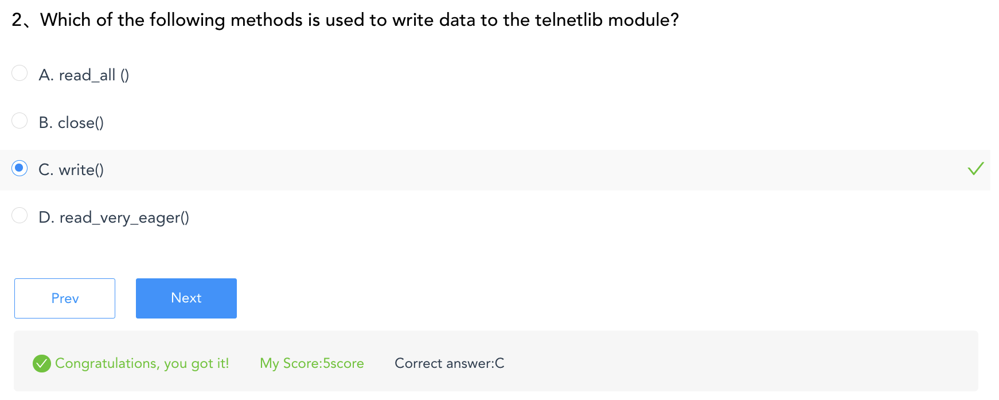

#### Explanation: Python in Networking

**Question:** Why is Python the most popular language for network automation?

**Correct Answer: A, B, and C**

**Why these are correct:**

Python has become the industry standard for "NetDevOps" because:

* **A (Simplicity):** It has a clean, readable syntax that is easy for traditional network engineers (who may not be programmers) to learn.
* **B (Libraries):** It has powerful libraries specifically for networking, such as **Netmiko** (for CLI), **NAPALM**, and **PyEZ**.
* **C (Platform Support):** Almost all modern network operating systems (like Huawei VRP, Cisco IOS XE) support Python scripts or provide APIs that Python can easily interact with.

---

### Q3-C21.png
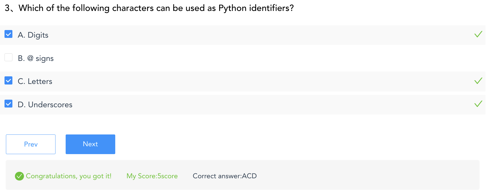

#### Explanation: RESTful APIs

**Question:** What does a RESTful API use to communicate between a controller and a network device?

**Correct Answer: B. HTTP/HTTPS**

**Why B is correct:**

REST (Representational State Transfer) is a set of rules for web-based communication. It uses standard web protocols—**HTTP** and **HTTPS**—to send and receive data. This allows network controllers to manage devices using common web methods like `GET` (to read config), `POST` (to create config), and `DELETE`.

---

### Q4-C21.png
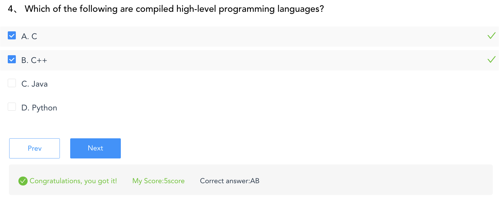

#### Explanation: JSON and XML Data Formats

**Question:** JSON and XML are commonly used to format data sent via APIs because they are machine-readable.

**Correct Answer: Right**

**Why "Right" is correct:**

Computers struggle to parse the raw text output of a `display ip interface brief` command because the spacing might change. **JSON** and **XML** provide a structured, "tagged" format. This ensures that an automation script always knows exactly where to find the IP address or the interface status, regardless of the device model.

---

### Q5-C21.png
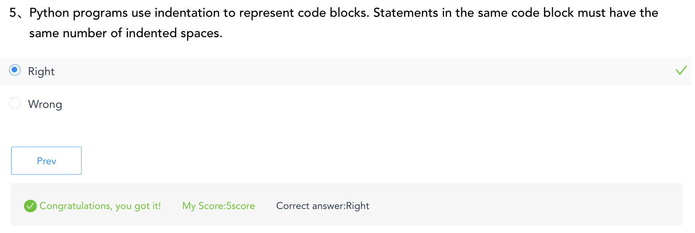

#### Explanation: Intent-Based Networking (IBN)

**Question:** What is the core concept of Intent-Based Networking (IBN)?

**Correct Answer: A. The network automatically translates business goals into network configurations.**

**Why A is correct:**

IBN is the next evolution of SDN. Instead of an engineer telling the network *how* to route traffic (CLI), the engineer tells the network *what* the goal is (e.g., "Ensure Video Conferencing has the highest priority"). The IBN controller then automatically calculates and pushes the necessary configurations to every device to achieve that goal.

**Total Questions:** 5

---

## Chapter 22: Campus Networks

**Location:** `C18-C22/C22/`

### Q1-C22.png
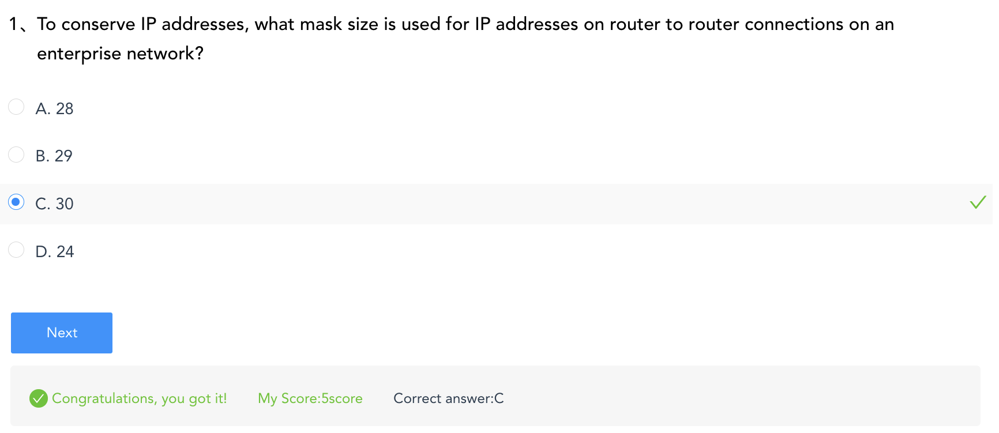

#### Explanation: The Three-Layer Hierarchical Model

**Question:** In a typical enterprise campus network, which layer is responsible for high-speed data switching and forms the backbone of the network?

**Correct Answer: A. Core Layer**

**Why A is correct:**

Modern campus networks follow a structured three-layer design to ensure scalability and performance:

* **Access Layer:** Connects end-user devices (PCs, APs, IP phones) to the network. Its main job is entry and security (Port Security, VLAN assignment).
* **Aggregation Layer:** Acts as a bridge between the Access and Core layers. It performs policy-based routing, security filtering (ACLs), and summarizes routes to keep the Core lean.
* **Core Layer:** The "Backbone." It is designed for maximum speed and reliability. It should not perform complex filtering; its only job is to switch traffic between different parts of the network as fast as possible.

---

### Q2-C22.png
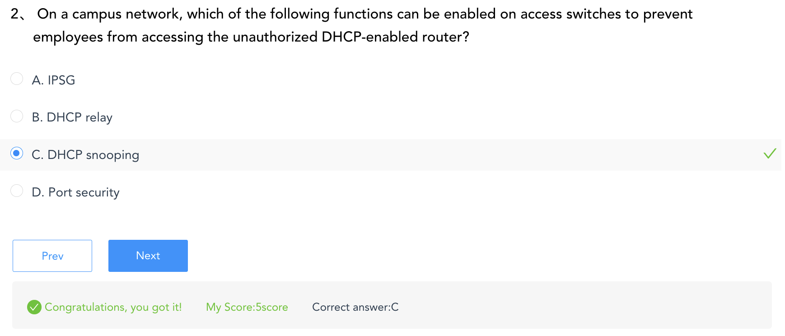

#### Explanation: Gateway Placement

**Question:** Where is the "User Gateway" (VLANIF interface) typically configured in a small-to-medium enterprise network?

**Correct Answer: B. Aggregation Layer or Core Layer**

**Why B is correct:**

In smaller networks, the **Core switch** often acts as the Layer 3 gateway for all VLANs. In larger networks, this duty is moved to the **Aggregation layer**. Placing the gateway here allows the switch to route traffic between local VLANs (East-West traffic) without sending every single packet up to the Core, reducing congestion.

---

### Q3-C22.png
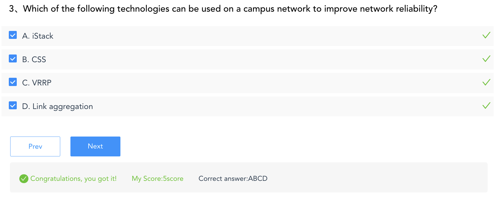

#### Explanation: Network Redundancy (Stacking)

**Question:** Which Huawei technology allows two or more physical switches to be managed as a single logical device to eliminate loops without using STP?

**Correct Answer: C. iStack / CSS**

**Why C is correct:**

While STP prevents loops, it does so by blocking ports, which wastes bandwidth.

* **iStack (Intelligent Stack):** Used for fixed-configuration switches (Access/Aggregation).
* **CSS (Cluster Switch System):** Used for high-end chassis switches (Core).
By "stacking" switches, you create a single logical unit. You can then use **Eth-Trunk** across different physical switches, providing high availability and full bandwidth utilization simultaneously.

---

### Q4-C22.png
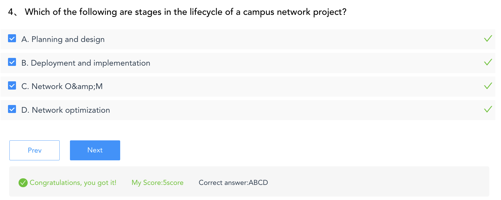

#### Explanation: Egress Network Design

**Question:** What is the primary purpose of the "Egress" part of the campus network?

**Correct Answer: A. To provide connection to external networks (Internet or WAN).**

**Why A is correct:**

The Egress is the "Exit/Entrance" of the network. This is where you typically find:

* **Firewalls:** To inspect incoming and outgoing traffic.
* **Routers:** To handle BGP/Static routing to the ISP.
* **NAT:** To translate private internal IPs to public external IPs.

---

### Q5-C22.png
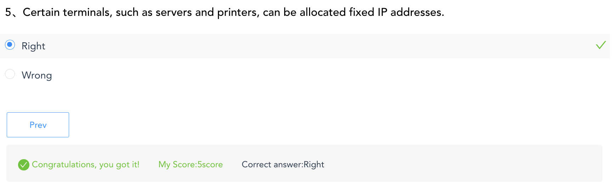

#### Explanation: Wireless Integration

**Question:** When deploying a WLAN in a large campus, which management mode is most commonly used for Access Points (APs)?

**Correct Answer: B. Fit AP + AC (Access Controller)**

**Why B is correct:**

In a "Fit AP" architecture, the **AC** centrally manages the configurations, security, and radio frequencies of all APs. This allows for seamless roaming (walking from one building to another without losing Wi-Fi) and centralized firmware updates, which is impossible in "Fat AP" (standalone) mode.

**Total Questions:** 5

---

## Summary Statistics

| Chapter | Questions | Location |
|---------|-----------|----------|
| Chapter 1 | 4 | `C1-C6/C1/` |
| Chapter 2 | 7 | `C1-C6/C2/` |
| Chapter 3 | 4 | `C1-C6/C3/` |
| Chapter 4 | 5 | `C1-C6/C4/` |
| Chapter 5 | 5 | `C1-C6/C5/` |
| Chapter 6 | 5 | `C1-C6/C6/` |
| Chapter 7 | 5 | `C7-C11/C7/` |
| Chapter 8 | 5 | `C7-C11/C8/` |
| Chapter 9 | 5 | `C7-C11/C9/` |
| Chapter 10 | 5 | `C7-C11/C10/` |
| Chapter 11 | 5 | `C7-C11/C11/` |
| Chapter 12 | 5 | `C12-C17/C12/` |
| Chapter 13 | 5 | `C12-C17/C13/` |
| Chapter 14 | 5 | `C12-C17/C14/` |
| Chapter 15 | 5 | `C12-C17/C15/` |
| Chapter 16 | 5 | `C12-C17/C16/` |
| Chapter 17 | 5 | `C12-C17/C17/` |
| Chapter 18 | 5 | `C18-C22/C18/` |
| Chapter 19 | 5 | `C18-C22/C19/` |
| Chapter 20 | 5 | `C18-C22/C20/` |
| Chapter 21 | 5 | `C18-C22/C21/` |
| Chapter 22 | 5 | `C18-C22/C22/` |
| **TOTAL** | **109** | |

---

## Important Note on Explanation Files

**The explanation files (C*-Explanation.md) appear to be mislabeled.** The content in each file does not always match the chapter number:

- **C8-Explanation.md** contains STP and Eth-Trunk content (belongs to C9 and C11)
- **C9-Explanation.md** contains ACL and NAT content (belongs to C12 and C14)
- **C10-Explanation.md** contains PPP and WLAN content (belongs to C16 and C17)
- **C11-Explanation.md** contains SNMP, IPv6, SDN, NFV content (belongs to C18, C19, C20)
- **C12-Explanation.md** contains Network Automation content (belongs to C21)
- **C14-Explanation.md** contains Network Automation content (belongs to C21)
- **C15-Explanation.md** contains Network Management content (belongs to C18)
- **C16-Explanation.md** contains Application Protocols content (belongs to C15)
- **C17-Explanation.md** contains Troubleshooting content (belongs to C22)
- **C18-Explanation.md** contains Campus Networks content (belongs to C22)
- **C20-Explanation.md** contains mixed content from various chapters
- **C21-Explanation.md** contains mixed content (BGP, VRRP, VXLAN, etc.)
- **C22-Explanation.md** contains Troubleshooting content (belongs to C22)

This document has been updated to map explanations to the correct chapters based on their actual content, but some questions may still have missing explanations due to the mislabeling issue.

---

## Related Documentation

- **Chapter Answers**: See `Chapter_Answers.md` for comprehensive answers to all chapter questions
- **Question Explanations**: See `C1-Explanation.md` through `C22-Explanation.md` for detailed explanations (note: files may be mislabeled)
- **Main Study Guide**: See `Huawei_HCIA-Datacom.md` for the complete study guide with all topics

---

## Usage

1. Scroll through this README to view all quiz questions as images with explanations
2. Review the questions and test your knowledge
3. Read the explanations to understand why certain answers are correct or incorrect
4. Use this as a comprehensive study guide for HCIA-Datacom exam preparation
5. Note: Some explanations may be missing due to mislabeled explanation files

---

*Last updated: 2024*
